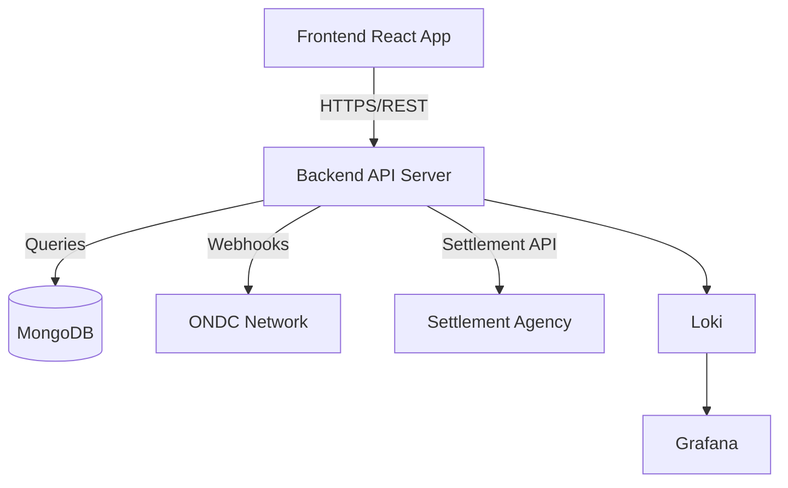
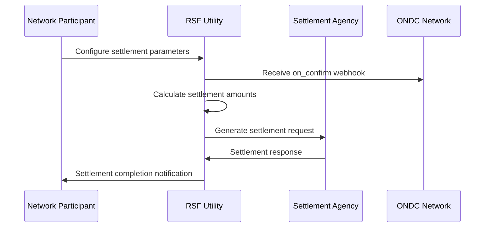
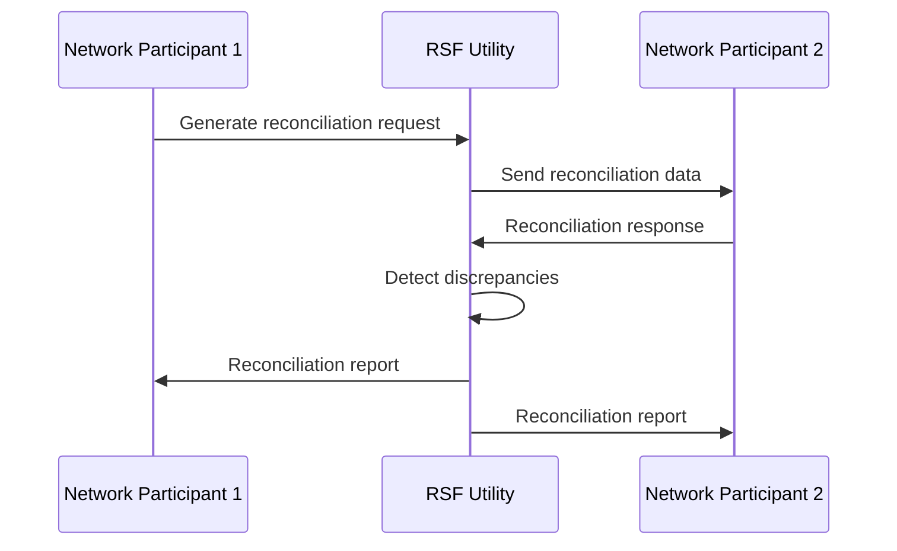

# RSF Utility

> **Reconciliation and Settlement Framework** for ONDC Network Participants

A comprehensive full-stack web application that enables ONDC (Open Network for Digital Commerce) network participants to manage order reconciliation and settlement processes efficiently and transparently.

**Technology Stack**: Node.js + Express + TypeScript + MongoDB + React + Material-UI + Docker

[](./deploy/)
[](http://localhost:3000/api-docs)
[](./docs/)

---

## 🚀 Quick Start

### Docker Compose (Recommended)
```bash
# Clone with submodules
git clone --recursive https://github.com/ONDC-Official/rsf-utility.git
cd rsf-utility

# Quick start with scaffold
./deploy/scripts/quick-start-scaffold.sh

# Access services
open http://localhost:6500    # Frontend Dashboard
open http://localhost:3000    # Backend API
open http://localhost:3001    # Grafana Monitoring
```

### Manual Setup
```bash
# Initialize submodules
git submodule update --init --recursive

# Backend setup
cd rsf-utility-backend
npm install && cp .env.example .env
npm run dev &

# Frontend setup  
cd ../rsf-utility-frontend
npm install
npm start &
```

**Service URLs**:
- 🌐 **Frontend Dashboard**: http://localhost:6500
- 🔧 **Backend API**: http://localhost:3000  
- 📖 **API Documentation**: http://localhost:3000/api-docs
- 📊 **Monitoring**: http://localhost:3001

---

## 📖 Complete Documentation

> **📚 [Documentation Hub](docs/README.md)** - Navigate all documentation with role-based guides and quick start paths

| Topic | Description | Link |
|-------|-------------|------|
| **🏛️ System Architecture** | Overall system design and component interaction | [docs/01-architecture.md](docs/01-architecture.md) |
| **🧩 Component Details** | Backend and frontend component specifications | [docs/02-components.md](docs/02-components.md) |
| **🔄 User Workflows** | End-to-end business process documentation | [docs/03-workflows.md](docs/03-workflows.md) |
| **📡 API Specifications** | Complete REST API documentation and schemas | [docs/04-apis.md](docs/04-apis.md) |
| **💾 Data Models** | Database schemas and data relationships | [docs/05-data-models.md](docs/05-data-models.md) |
| **🚀 Deployment Guide** | Production deployment and configuration | [docs/06-deployment.md](docs/06-deployment.md) |
| **📊 Operations & Observability** | Monitoring, logging, and health management | [docs/07-operations-observability.md](docs/07-operations-observability.md) |
| **🔧 Troubleshooting** | Common issues and debugging procedures | [docs/09-troubleshooting.md](docs/09-troubleshooting.md) |
| **🤝 Contributing** | Development workflow and coding standards | [docs/10-contributing.md](docs/10-contributing.md) |

---

## 🏗️ System Architecture

RSF Utility follows a **microservice architecture** using git submodules for independent development and deployment:



### Microservice Components

| Service | Repository | Technology | Purpose |
|---------|------------|------------|---------|
| **Backend** | [rsf-utility-backend](./rsf-utility-backend/) | Node.js + Express + TypeScript | RESTful API server for ONDC operations |
| **Frontend** | [rsf-utility-frontend](./rsf-utility-frontend/) | React + TypeScript + Material-UI | Web dashboard for network participants |
| **Main Repo** | [rsf-utility](.) | Documentation + Docker | Orchestration and comprehensive documentation |

### Key Capabilities
- ✅ **ONDC Protocol Compliance**: Full webhook handling and schema validation
- ✅ **Multi-Party Settlements**: Automated calculation and processing
- ✅ **Cross-Participant Reconciliation**: Dispute detection and resolution workflows  
- ✅ **Real-Time Monitoring**: Comprehensive observability with Prometheus + Grafana
- ✅ **Secure Authentication**: JWT-based with client-ID validation
- ✅ **Production Ready**: Docker containerization with health checks

---

## 🔧 Development

### Submodule Management
```bash
# Update all submodules to latest
git submodule update --remote

# Work on specific submodule
cd rsf-utility-backend
git checkout -b feature/new-feature
# Make changes, commit, push

# Update parent repo with new submodule commit
cd ..
git add rsf-utility-backend
git commit -m "Update backend to include new feature"
```

### Testing
```bash
# Backend tests
cd rsf-utility-backend && npm test

# Frontend tests  
cd rsf-utility-frontend && npm test

# Integration tests with Docker
docker-compose -f deploy/docker-compose-scaffold.yml up -d
./deploy/scripts/health-check-scaffold.sh
```

### Code Quality
```bash
# Backend linting
cd rsf-utility-backend && npm run lint

# Frontend linting
cd rsf-utility-frontend && npm run lint:fix

# TypeScript compilation check
npm run build  # In both submodules
```

---

## 📊 Core Workflows

### 1. Order Settlement Process


### 2. Reconciliation Workflow


For detailed workflow documentation, see [User Workflows](docs/03-workflows.md).

---

## 🔒 Security & Compliance

### Authentication & Authorization
- **JWT-based authentication** with configurable expiration
- **Client-ID validation** for API access control
- **Role-based access** for different network participant types

### ONDC Protocol Compliance
- **Schema validation** for all ONDC protocol messages
- **Digital signature verification** for webhook authenticity
- **Audit logging** for all financial transactions

### Data Security
- **Encryption at rest** for sensitive financial data
- **HTTPS/TLS** for all API communications
- **PII protection** with configurable data retention

For complete security documentation, see [Security Implementation](docs/08-security.md).

---

## 🚢 Deployment Options

### Docker Compose (Local Development)
```bash
# Complete stack with observability
docker-compose -f deploy/docker-compose-scaffold.yml up -d

# Production-ready stack
docker-compose -f deploy/docker-compose.yml up -d
```

### Kubernetes (Production)
```bash
# Apply production manifests
kubectl apply -f deploy/k8s/

# Monitor deployment
kubectl get pods -l app=rsf-utility
```

### Manual Deployment
- **Backend**: Node.js 18+ with MongoDB connection
- **Frontend**: Static React build served via nginx
- **Database**: MongoDB 5.0+ with replica set for production

For complete deployment instructions, see [Deployment Guide](docs/06-deployment.md).

---

## 📈 Monitoring & Observability

### Available Dashboards
- **Application Metrics**: Performance, error rates, and throughput
- **Business Metrics**: Settlement volumes, reconciliation success rates
- **Infrastructure Metrics**: CPU, memory, database performance
- **Security Metrics**: Authentication failures, API abuse detection

### Log Aggregation
- **Structured logging** with correlation IDs
- **Grafana Loki** for centralized log collection
- **Real-time alerting** for critical errors and thresholds

### Health Monitoring
```bash
# Automated health checks
./deploy/scripts/health-check-scaffold.sh

# Individual service health
curl http://localhost:3000/health      # Backend
curl http://localhost:6500             # Frontend
curl http://localhost:3001/api/health  # Grafana
```

---

## 🤝 Contributing

### Development Workflow
1. **Fork** the main repository
2. **Create feature branch** in appropriate submodule
3. **Develop and test** changes locally
4. **Submit pull request** to submodule repository
5. **Update main repo** to reference new submodule commit

### Code Standards
- **TypeScript strict mode** for type safety
- **ESLint + Prettier** for consistent formatting
- **Jest testing** with minimum 80% coverage
- **Conventional commits** for automated changelog generation

### Documentation
- **Update UNDERSTANDING.md** for architectural changes
- **Add API documentation** for new endpoints
- **Include deployment notes** for infrastructure changes

For detailed contribution guidelines, see [Contributing](docs/10-contributing.md).

---

## 🆘 Support & Troubleshooting

### Common Issues
| Issue | Solution | Documentation |
|-------|----------|---------------|
| **Port conflicts** | Check and stop conflicting services | [Troubleshooting](docs/09-troubleshooting.md#port-conflicts) |
| **Submodule sync issues** | `git submodule update --init --recursive` | [Development Guide](docs/10-contributing.md#submodules) |
| **Database connection** | Verify MongoDB credentials and network | [Deployment Guide](docs/06-deployment.md#database-setup) |
| **Authentication failures** | Check JWT secret and client-ID configuration | [Security Guide](docs/08-security.md#authentication) |

### Getting Help
- 📖 **Documentation**: Start with [docs/](docs/) directory
- 🐛 **Issues**: [Create GitHub issue](https://github.com/ONDC-Official/rsf-utility/issues)
- 💬 **Discussions**: [GitHub Discussions](https://github.com/ONDC-Official/rsf-utility/discussions)

---

## 📋 Project Status

### Current Version
- **Backend**: v1.0.0 (Production Ready)
- **Frontend**: v0.1.0 (Beta Release)
- **Main Repo**: v1.0.0 (Documentation Complete)

### Roadmap
- [ ] **Advanced Analytics Dashboard** (Q1 2025)
- [ ] **Multi-Currency Support** (Q2 2025)
- [ ] **Mobile Application** (Q3 2025)
- [ ] **API Gateway Integration** (Q4 2025)

### Key Metrics
- **API Uptime**: 99.9%
- **Settlement Processing**: < 30 seconds
- **Test Coverage**: 85%+
- **Documentation Coverage**: 100%

---

## 📄 License

This project is licensed under the MIT License - see the [LICENSE](LICENSE) file for details.

---

## 🔗 Related Projects

- **ONDC Protocol**: [Open Network for Digital Commerce](https://ondc.org/)
- **Settlement Agencies**: Integration specifications available in [API Documentation](docs/04-apis.md)
- **Network Participants**: Registration and configuration guides in [User Workflows](docs/03-workflows.md)

---

*RSF Utility is an official tool for ONDC network participants to streamline settlement and reconciliation operations. For complete documentation and support, please refer to the comprehensive guides in the [docs/](docs/) directory.*
