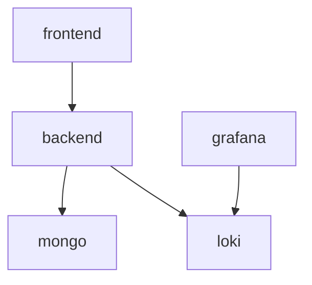

# RSF Utility Docker Compose Scaffold

This scaffold provides a comprehensive Docker Compose setup for running the complete RSF Utility system locally with observability and monitoring capabilities.

## 🚀 Quick Start

```bash
# 1. Initialize submodules
git submodule update --init --recursive

# 2. Set up environment
cp .env.scaffold.example .env
# Edit .env with your configuration values

# 3. Start the complete stack
docker-compose -f docker-compose-scaffold.yml up -d

# 4. Verify services are running
docker-compose -f docker-compose-scaffold.yml ps
```

## 📋 Service Overview

### Core Application Services
| Service | Port | Description | Health Check |
|---------|------|-------------|--------------|
| **backend** | 3000 | Node.js API server | `curl http://localhost:3000/health` |
| **frontend** | 6500 | React web application | `curl http://localhost:6500` |
| **mongo** | 27017 | MongoDB database | `docker-compose exec mongo mongosh --eval "db.adminCommand('ping')"` |

### Observability Stack
| Service | Port | Description | Access |
|---------|------|-------------|--------|
| **loki** | 3100 | Log aggregation | `curl http://localhost:3100/ready` |
| **grafana** | 3001 | Metrics & logs dashboard | http://localhost:3001 (admin/admin) |

### TODO: Additional Services (Commented)
- **orderdb, settledb, recondb, configdb, auditdb**: Separate MongoDB instances for microservice isolation
- **prometheus**: Metrics collection (port 9090)
- **redis**: Caching and session storage (port 6379)
- **nginx**: Reverse proxy (ports 80/443)

## 🛠 Configuration

### Required Environment Variables

Create `.env` from `.env.scaffold.example` and configure:

```bash
# Core credentials (REQUIRED)
MONGO_ROOT_PASSWORD=your-secure-mongo-password
JWT_SECRET=your-super-secret-jwt-key-256-bits
CLIENT_ID=your-client-id

# Grafana admin (REQUIRED)
GRAFANA_ADMIN_PASSWORD=your-grafana-password

# Settlement integration
SETTLEMENT_AGENCY_URL=https://your-settlement-agency.com/api
SETTLEMENT_AGENCY_KEY=your-settlement-agency-api-key
```

### Service Dependencies



## 📊 Accessing Services

### Application URLs
- **Frontend Dashboard**: http://localhost:6500
- **Backend API**: http://localhost:3000
- **API Documentation**: http://localhost:3000/api-docs
- **Health Endpoint**: http://localhost:3000/health

### Observability URLs
- **Grafana Dashboard**: http://localhost:3001 (admin/[your-password])
- **Loki Logs**: http://localhost:3100 (direct API access)
- **Application Logs**: Available in Grafana via Loki datasource

### Database Access
```bash
# Connect to MongoDB
docker-compose -f docker-compose-scaffold.yml exec mongo mongosh -u admin -p [your-password]

# View database collections
docker-compose -f docker-compose-scaffold.yml exec mongo mongosh -u admin -p [your-password] --eval "db.getSiblingDB('rsf-utility').getCollectionNames()"
```

## 🔧 Development Commands

### Service Management
```bash
# Start all services
docker-compose -f docker-compose-scaffold.yml up -d

# View logs for all services
docker-compose -f docker-compose-scaffold.yml logs -f

# View logs for specific service
docker-compose -f docker-compose-scaffold.yml logs -f backend

# Restart specific service
docker-compose -f docker-compose-scaffold.yml restart backend

# Stop all services
docker-compose -f docker-compose-scaffold.yml down

# Stop and remove volumes (⚠️ destroys data)
docker-compose -f docker-compose-scaffold.yml down -v
```

### Database Operations
```bash
# Database backup
docker-compose -f docker-compose-scaffold.yml exec mongo mongodump --out /backup --authenticationDatabase admin -u admin -p [your-password]

# Database restore
docker-compose -f docker-compose-scaffold.yml exec mongo mongorestore /backup --authenticationDatabase admin -u admin -p [your-password]

# Initialize database collections
docker-compose -f docker-compose-scaffold.yml exec mongo mongosh -u admin -p [your-password] /docker-entrypoint-initdb.d/init.js
```

### Health Checks
```bash
# Check all service health
./scripts/health-check.sh

# Individual service checks
curl -f http://localhost:3000/health    # Backend health
curl -f http://localhost:6500           # Frontend health  
curl -f http://localhost:3100/ready     # Loki health
curl -f http://localhost:3001/api/health # Grafana health
```

## 📁 Volume Management

### Persistent Data Locations
- **mongo_data**: MongoDB database files
- **backend_logs**: Application log files  
- **loki_data**: Log aggregation storage
- **grafana_data**: Dashboard configurations and data

### Volume Commands
```bash
# List volumes
docker volume ls | grep rsf

# Inspect volume
docker volume inspect rsf-utility_mongo_data

# Backup volume
docker run --rm -v rsf-utility_mongo_data:/source -v $(pwd)/backup:/backup alpine tar czf /backup/mongo_backup.tar.gz -C /source .

# Restore volume
docker run --rm -v rsf-utility_mongo_data:/target -v $(pwd)/backup:/backup alpine tar xzf /backup/mongo_backup.tar.gz -C /target
```

## 🐛 Troubleshooting

### Common Issues

1. **Port Conflicts**
   ```bash
   # Check what's using ports
   lsof -i :3000 -i :6500 -i :27017 -i :3001 -i :3100
   
   # Kill processes if needed
   sudo kill -9 $(lsof -ti:3000)
   ```

2. **Submodule Issues**
   ```bash
   # Reset submodules
   git submodule update --init --recursive --force
   
   # Check submodule status
   git submodule status
   ```

3. **Database Connection Issues**
   ```bash
   # Check MongoDB logs
   docker-compose -f docker-compose-scaffold.yml logs mongo
   
   # Test connection
   docker-compose -f docker-compose-scaffold.yml exec mongo mongosh --eval "db.adminCommand('ismaster')"
   ```

4. **Build Issues**
   ```bash
   # Clean rebuild
   docker-compose -f docker-compose-scaffold.yml build --no-cache
   
   # Remove dangling images
   docker image prune -f
   ```

### Debug Mode
```bash
# Run with debug logging
LOG_LEVEL=debug docker-compose -f docker-compose-scaffold.yml up

# Access container shell
docker-compose -f docker-compose-scaffold.yml exec backend /bin/bash
docker-compose -f docker-compose-scaffold.yml exec frontend /bin/bash
```

## 🔒 Security Considerations

### Production Deployment
- [ ] Change all default passwords
- [ ] Use external secret management (not .env files)
- [ ] Enable SSL/TLS with proper certificates  
- [ ] Configure firewall rules and network isolation
- [ ] Enable MongoDB authentication and authorization
- [ ] Set up regular security scanning
- [ ] Implement backup and disaster recovery procedures

### Container Security
- [ ] Use non-root users in containers
- [ ] Scan images for vulnerabilities
- [ ] Set resource limits and quotas
- [ ] Enable container runtime security

## 📚 Additional Documentation

- [Complete System Documentation](../docs/)
- [Backend Service Details](../rsf-utility-backend/UNDERSTANDING.md)
- [Frontend Application Details](../rsf-utility-frontend/UNDERSTANDING.md)
- [Production Deployment Guide](../docs/06-deployment.md)

## 🆘 Support

For issues with this scaffold:

1. **Check Service Status**: `docker-compose -f docker-compose-scaffold.yml ps`
2. **Review Logs**: `docker-compose -f docker-compose-scaffold.yml logs -f [service-name]`
3. **Verify Configuration**: Ensure `.env` file has all required values
4. **Test Network Connectivity**: Verify services can communicate
5. **Consult Documentation**: See [troubleshooting guide](../docs/06-deployment.md#troubleshooting)

## 🔄 Scaffold vs Production

This scaffold includes:
- ✅ Complete application stack (backend + frontend + database)
- ✅ Basic observability (Loki + Grafana)
- ✅ Development-friendly configuration
- ✅ Health checks and monitoring
- ⚠️ TODO: Production hardening (SSL, secrets management, scaling)
- ⚠️ TODO: Microservice database isolation
- ⚠️ TODO: Advanced monitoring (Prometheus + alerting)

For production deployment, see the main `docker-compose.yml` and deployment documentation.
