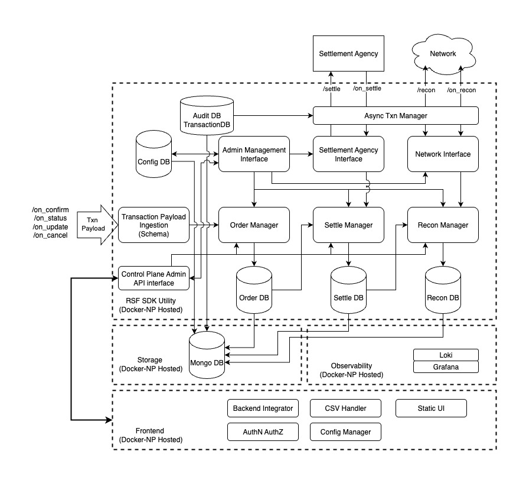

# RSF Utility System Architecture

This document provides a comprehensive system-level view of the RSF (Reconciliation and Settlement Framework) Utility and how its components interact to enable ONDC network transaction processing.

## Table of Contents
- [System Overview](#system-overview)
- [High-Level Architecture](#high-level-architecture)
- [System Boundaries](#system-boundaries)
- [Component Architecture](#component-architecture)
- [Data Flow Diagrams](#data-flow-diagrams)
- [Storage Architecture](#storage-architecture)
- [Integration Points](#integration-points)
- [Observability Stack](#observability-stack)

## System Overview

RSF Utility is a full-stack microservice application designed for ONDC (Open Network for Digital Commerce) network participants to manage order reconciliation and settlement operations. The system provides end-to-end transaction processing from order ingestion to settlement completion.

### Core Capabilities
- **Transaction Processing**: Ingestion and validation of ONDC protocol payloads with schema compliance
- **Settlement Management**: Multi-party settlement calculation, execution, and status tracking
- **Reconciliation**: Cross-participant transaction reconciliation with financial breakdown tracking
- **Administrative Interface**: Web-based management dashboard with role-based access control
- **Network Integration**: ONDC network protocol compliance with registry endpoints
- **Audit & Monitoring**: Comprehensive logging, observability, and health monitoring

### Key Business Features
- **Transaction payload ingestion** by network participants
- **Settlement interactions** with external Settlement Agency (SA)
- **Reconciliation workflows** with counterparty network participants
- **Intuitive UI** for operators (Finance team, Support team) and configuration management
- **Operational data persistence** in MongoDB with audit trails
- **Observability exposure** using Prometheus metrics and Grafana Loki logging
- **Secure API traffic** with JWT authentication and TLS encryption

### Technology Foundation
```typescript
interface TechnologyStack {
  backend: {
    runtime: "Node.js 18+ with TypeScript 5.9",
    framework: "Express.js 5.1 with middleware pipeline",
    database: "MongoDB 8.17 with Mongoose ODM",
    auth: "JWT-based authentication with client-ID validation",
    validation: "Zod 4.0 schemas + AJV JSON Schema validation",
    testing: "Jest 30.0 with MongoDB Memory Server"
  },
  frontend: {
    framework: "React 17.0 with TypeScript 4.5",
    ui: "Material-UI 5.18 with custom theming", 
    state: "React Query 3.34 + Context API",
    http: "Axios 0.26 with automatic token refresh",
    forms: "React Hook Form 7.62 with validation",
    testing: "React Testing Library with Jest DOM"
  },
  infrastructure: {
    containerization: "Docker with multi-stage builds",
    orchestration: "Docker Compose for service coordination",
    monitoring: "Prometheus 15.1 + Grafana Loki 6.1",
    deployment: "EC2 with GitHub Actions CI/CD workflows",
    security: "Rate limiting, CORS, JWT tokens"
  }
}
```

## High-Level Architecture

### System Overview Diagram

*Comprehensive system architecture showing component interactions and data flow*

### Component Interaction Flow


## System Boundaries

### 1. Admin Management Boundary
**Scope**: User configuration, network participant setup, system administration
- **Components**: User management, provider configuration, system settings
- **Interfaces**: Web UI, REST API endpoints (`/ui/*`)
- **Data**: User profiles, network configurations, access controls
- **Security**: JWT authentication, role-based access

### 2. Settlement Agency Interface Boundary  
**Scope**: External settlement processing and callback handling
- **Components**: Settlement request generation, callback processing
- **Interfaces**: HTTP APIs for settlement agencies
- **Data**: Settlement payloads, transaction references, status tracking
- **Protocols**: ONDC settlement protocol compliance

### 3. Network Interface Boundary
**Scope**: ONDC network communication and protocol compliance
- **Components**: Transaction ingestion, reconciliation processing
- **Interfaces**: ONDC webhook endpoints (`/api/*`)
- **Data**: Order transactions, reconciliation requests, network messages
- **Protocols**: ONDC transaction protocol (on_confirm, on_status, etc.)

### 4. Async Transaction Manager Boundary
**Scope**: Background transaction processing and state management
- **Components**: Transaction correlation, state machines, audit logging
- **Interfaces**: Internal service APIs, database transactions
- **Data**: Transaction state, correlation IDs, audit trails
- **Features**: Atomic operations, retry mechanisms, error handling

## Component Architecture

### Backend Service Architecture


### Service Responsibilities

#### Core Services
- **OrderService**: Order CRUD operations, lifecycle management, due date tracking
- **SettleDbManagementService**: Settlement calculation, preparation, multi-party coordination
- **ReconDbService**: Reconciliation workflow, cross-participant communication
- **UserService**: Network participant configuration, provider management
- **TransactionService**: Transaction correlation, audit logging, state persistence
- **AuthService**: JWT token management, client authentication
- **RsfOrchestratorService**: Cross-service coordination, workflow automation

#### Repository Pattern
```typescript
interface RepositoryPattern {
  abstraction: "Data access layer isolation",
  implementation: "Mongoose ODM with MongoDB",
  features: [
    "Query optimization with indexes",
    "Transaction support for atomic operations", 
    "Connection pooling for performance",
    "Schema validation at database level"
  ]
}
```

### Frontend Component Architecture


## Data Flow Diagrams

### 1. Transaction Processing Flow


### 2. Settlement Generation Flow


### 3. Reconciliation Workflow


## Storage Architecture

### MongoDB Collection Design


### Database Configuration

#### Indexes for Performance
```typescript
interface DatabaseIndexes {
  orders: [
    { order_id: 1, user_id: 1 },    // Compound index for lookups
    { user_id: 1, state: 1 },       // Status filtering
    { due_date: 1 },                // Date range queries
    { settle_status: 1 },           // Settlement status
    { created_at: -1 }              // Time-based ordering
  ],
  settlements: [
    { user_id: 1, order_id: 1 },    // Primary lookup
    { settlement_id: 1 },           // Settlement tracking
    { status: 1 },                  // Status filtering
    { due_date: 1 },                // Payment due dates
    { type: 1 }                     // Settlement type filtering
  ],
  reconciliations: [
    { user_id: 1, order_id: 1 },    // Primary lookup
    { recon_status: 1 },            // Status filtering
    { settlement_id: 1 },           // Settlement correlation
    { transaction_id: 1 }           // Transaction tracking
  ],
  transactions: [
    { "context.transaction_id": 1 }, // Transaction correlation
    { "context.message_id": 1 },     // Message tracking
    { "context.action": 1 },         // Action filtering
    { createdAt: -1 }               // Time-based queries
  ]
}
```

#### Connection & Performance
- **Connection Pooling**: MongoDB driver with configurable pool size
- **Transaction Support**: Multi-document ACID transactions for complex operations
- **Schema Validation**: Mongoose schema validation with custom validators
- **Data Consistency**: Atomic operations for critical business workflows

## Integration Points

### External System Integration

#### 1. ONDC Network Integration
```typescript
interface ONDCIntegration {
  endpoints: {
    incoming: ["/api/on_confirm", "/api/on_status", "/api/on_update", "/api/on_cancel"],
    outgoing: ["Registry lookup", "Settlement requests", "Reconciliation"]
  },
  protocols: {
    validation: "ONDC schema compliance",
    authentication: "Digital signatures",
    correlation: "Transaction and Message IDs"
  },
  features: {
    retry: "Automatic retry with backoff",
    timeout: "Configurable request timeouts", 
    monitoring: "Request/response logging"
  }
}
```

#### 2. Settlement Agency Integration
```typescript
interface SettlementAgencyIntegration {
  communication: {
    protocol: "HTTPS REST API",
    format: "JSON payloads",
    authentication: "API keys and certificates"
  },
  operations: {
    settle: "Initiate settlement requests",
    callback: "Handle settlement status updates",
    query: "Settlement status inquiries"
  },
  reliability: {
    retry: "Failed request retry logic",
    correlation: "Settlement reference tracking",
    timeout: "Configurable API timeouts"
  }
}
```

### Internal System Communication

#### Frontend-Backend Communication
```typescript
interface FrontendBackendIntegration {
  protocol: "HTTPS REST API",
  authentication: "JWT Bearer tokens",
  endpoints: {
    admin: "/ui/users, /ui/auth/*",
    orders: "/ui/orders/{userId}",
    settlements: "/ui/settle/{userId}/*", 
    reconciliation: "/ui/recon/{userId}/*",
    triggers: "/ui/trigger/{userId}/{action}"
  },
  features: {
    caching: "React Query intelligent caching",
    realtime: "HTTP polling for status updates",
    offline: "Graceful degradation capabilities",
    validation: "Type-safe request/response handling"
  }
}
```

## Observability Stack

### Monitoring Architecture


### Observability Features

#### Metrics Collection
```typescript
interface MetricsCollection {
  application: {
    http_requests: "Request count and duration",
    database_queries: "Query performance metrics", 
    settlement_processing: "Settlement operation metrics",
    reconciliation_status: "Reconciliation workflow metrics"
  },
  system: {
    cpu_usage: "CPU utilization monitoring",
    memory_usage: "Memory consumption tracking",
    disk_io: "Disk read/write operations",
    network_io: "Network traffic monitoring"
  },
  business: {
    transaction_volume: "Daily transaction counts",
    settlement_amounts: "Settlement value tracking",
    error_rates: "Business logic error rates",
    sla_compliance: "Service level agreement metrics"
  }
}
```

#### Logging Strategy
```typescript
interface LoggingStrategy {
  structured: "JSON format for machine parsing",
  correlation: "Request correlation IDs",
  levels: ["debug", "info", "warn", "error"],
  transport: {
    development: "Console with colors",
    production: "Grafana Loki aggregation"
  },
  content: {
    request_response: "API call logging",
    business_events: "Settlement and reconciliation events",
    errors: "Detailed error context and stack traces",
    performance: "Operation timing and resource usage"
  }
}
```

#### Health Monitoring
- **Health Check Endpoints**: `/health` for application status
- **Database Connectivity**: MongoDB connection monitoring
- **External Service Status**: ONDC network and settlement agency availability
- **Resource Monitoring**: Memory, CPU, and disk usage tracking
- **Alert Configuration**: Threshold-based alerting for critical metrics

---

This architecture document provides the foundation for understanding RSF Utility's system design and serves as a reference for development, deployment, and maintenance activities.
