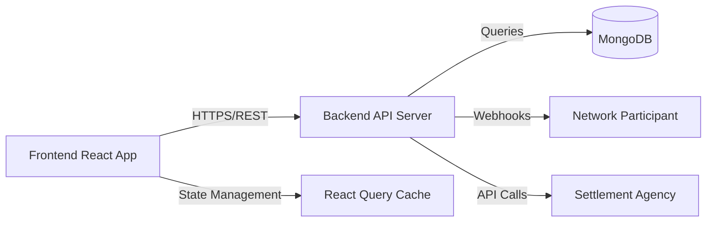

# Component Documentation

## System Overview

The RSF Utility system comprises specialized components managing ONDC settlement and reconciliation workflows. The system is implemented as a microservice architecture with two independent git submodules that work together to provide a complete solution.

## Submodule Architecture Summary

### Backend Submodule (`rsf-utility-backend`)
**Repository**: `https://github.com/ONDC-Official/rsf-utility-backend`  
**Purpose**: RESTful API server providing ONDC reconciliation and settlement operations  
**Technology Stack**: Node.js + Express + TypeScript + MongoDB + Mongoose  

**Key Capabilities**:
- ONDC protocol webhook handling (`/api/*` endpoints)
- Internal UI operations (`/ui/*` endpoints)
- Settlement calculation and processing
- Reconciliation workflow management
- JWT-based authentication and authorization
- Comprehensive audit logging and monitoring
- Health monitoring with Prometheus metrics

**Architecture Layers**:
- **Controller Layer**: HTTP request handling and response formatting
- **Service Layer**: Business logic and workflow orchestration
- **Repository Layer**: Data access abstraction with Mongoose ODM
- **Database Layer**: MongoDB with strategic indexing

**Documentation**: Complete backend documentation available in `rsf-utility-backend/UNDERSTANDING.md`

### Frontend Submodule (`rsf-utility-frontend`)
**Repository**: `https://github.com/ONDC-Official/rsf-utility-frontend`  
**Purpose**: React-based dashboard for network participants to manage settlements and reconciliations  
**Technology Stack**: React 17 + TypeScript + Material-UI + React Query + React Hook Form  

**Key Capabilities**:
- Network participant configuration and management
- Order management with filtering and bulk operations
- Settlement generation and monitoring workflows
- Reconciliation request and response handling
- Real-time data updates with intelligent caching
- Responsive design with ONDC branding

**Architecture Layers**:
- **Provider Hierarchy**: Theme → Router → Query → Auth → User contexts
- **Page Components**: Main business feature pages with complex workflows
- **Common Components**: Reusable UI elements and form components
- **Service Layer**: API integration with automatic token management

**Documentation**: Complete frontend documentation available in `rsf-utility-frontend/UNDERSTANDING.md`

**Recent Updates** (August 2025):
- Enhanced frontend documentation with comprehensive architecture details (commit 8d21de1)
- Backend environment configuration standardization for Docker compatibility (commits 656ec21, 85e3284)
- Updated CLIENT_ID configuration to REACT_APP_CLIENT_ID for frontend compatibility

## Integration Between Submodules

### Communication Pattern


### API Contract
- **Authentication**: JWT tokens issued by `/ui/auth/sign-token`
- **Request Format**: JSON with standardized success/error responses
- **File Uploads**: Multipart form data for CSV bulk operations
- **Real-time Updates**: HTTP polling with React Query intelligent caching

---

## Backend Core Components

### 1. Transaction Payload Ingestion

**Purpose**: Validates and ingests ONDC protocol transaction payloads (on_confirm, on_cancel, on_settle)

**Implementation**: `src/controller/order-controller.ts` + `src/services/order-service.ts`

**Responsibilities**:
- Schema validation using Zod parsers for ONDC compliance
- Payload deserialization and type checking
- Data transformation for internal storage
- Protocol compliance verification

**Dependencies**:
- `Zod Schema Validators` (retail/rsf schema definitions)
- `MongoDB Transaction Collection`
- `Request/Response Logging Middleware`

**Public Interface**:
```typescript
POST /api/on_confirm - ONDC order confirmation payload
POST /api/on_cancel - ONDC order cancellation payload  
POST /api/on_settle - ONDC settlement completion payload
POST /api/on_status - ONDC status update payload
```

**Configuration**:
- `MONGO_URI` - Database connection
- `REQUEST_TIMEOUT` - API timeout settings
- `SCHEMA_VALIDATION_MODE` - Strict/lenient validation

**Failure Modes**:
- Schema validation failures → 400 error with field details
- Database connection errors → 503 service unavailable
- Malformed JSON → 422 validation error

**Example Log Lines**:
```
INFO: Transaction payload ingestion started - orderId: ORD123
ERROR: Schema validation failed - field: message.order.id, error: required
WARN: Duplicate transaction received - transactionId: TXN456
```

---

### 2. Order Manager

**Purpose**: Manages order lifecycle, status tracking, and order-related business logic

**Responsibilities**:
- Order CRUD operations with user context
- Order status state machine management
- User validation and authorization
- Order aggregation and filtering

**Dependencies**:
- `OrderRepository` - Database layer
- `UserService` - User validation
- `MongoDB Orders Collection`

**Public Interface**:
```typescript
class OrderService {
  async getOrders(userId: string, queryParams: OrderQuerySchema)
  async getSingleOrder(userId: string, orderId: string)
  async updateOrderStatus(orderId: string, status: OrderStatus)
  async validateOrdersForUser(userId: string, orderIds: string[])
}
```

**Configuration**:
- `ORDER_PAGE_LIMIT` - Maximum orders per query (default: 50)
- `ORDER_STATUS_TIMEOUT` - Status change timeout (30s)
- `CACHE_TTL` - Order cache duration (5 minutes)

**Failure Modes**:
- Invalid user ID → 404 user not found
- Order not found → 404 order not found
- Unauthorized order access → 403 forbidden
- Invalid status transition → 422 invalid state

**Example Log Lines**:
```
INFO: Fetching orders for user - userId: USR123, page: 1, limit: 10
DEBUG: Order status updated - orderId: ORD456, oldStatus: pending, newStatus: confirmed
ERROR: Invalid order access attempt - userId: USR789, orderId: ORD456
```

---

### 3. Settle Manager

**Purpose**: Manages settlement calculations, CSV bulk uploads, and settlement workflow orchestration

**Responsibilities**:
- Settlement CRUD operations with pagination
- CSV bulk upload processing via multer middleware
- Settlement calculation validation
- Settlement status tracking and updates

**Dependencies**:
- `SettleRepository` - Database layer
- `UserService` - User validation
- `TransactionService` - Transaction logging
- `CSV Upload Middleware` - File processing

**Public Interface**:
```typescript
class SettleDbManagementService {
  async getSettlements(userId: string, query: GetSettlementsQuerySchema)
  async updateSettlementsViaResponse(userId: string, payload: SettlePayload, response: any)
  async checkSettlementsForUser(userId: string, settlePayload: SettlePayload)
}
```

**Configuration**:
- `CSV_MAX_FILE_SIZE` - 10MB upload limit
- `CSV_BATCH_SIZE` - Bulk processing batch size (100 records)
- `SETTLEMENT_TIMEOUT` - Processing timeout (5 minutes)

**Failure Modes**:
- CSV validation errors → 422 with detailed field errors
- File size exceeded → 413 payload too large
- Invalid settlement calculations → 400 calculation error
- Missing required fields → 400 missing fields

**Example Log Lines**:
```
INFO: Processing CSV file upload - filename: settlements.csv, rowCount: 150
DEBUG: Settlement calculation validated - orderId: ORD123, collectorSettlement: 850.75
ERROR: CSV parsing failed - row: 5, field: total_order_value, error: invalid number
WARN: Large settlement amount detected - orderId: ORD789, amount: 50000.00
```

---

### 4. Recon Manager

**Purpose**: Handles reconciliation workflow, mismatch detection, and recon payload generation

**Responsibilities**:
- Reconciliation data comparison and mismatch identification
- Recon payload generation and validation
- Settlement-to-recon data transformation
- Recon status tracking and audit trails

**Dependencies**:
- `ReconRepository` - Database layer
- `SettleService` - Settlement data source
- `UserService` - User validation
- `TransactionService` - Audit logging

**Public Interface**:
```typescript
class ReconService {
  async generateReconPayload(userId: string, reconData: ReconGenerateSchema)
  async getReconciliations(userId: string, query: ReconQuerySchema)
  async processReconResponse(userId: string, payload: ReconPayload, response: any)
}
```

**Configuration**:
- `RECON_TOLERANCE` - Mismatch threshold (0.01)
- `RECON_BATCH_SIZE` - Processing batch size (50 records)
- `AUTO_RECON_ENABLED` - Automatic reconciliation flag

**Failure Modes**:
- Data mismatch beyond tolerance → 422 reconciliation failed
- Missing settlement data → 404 settlement not found
- Invalid recon payload → 400 validation error
- Timeout during processing → 408 timeout error

**Example Log Lines**:
```
INFO: Generating recon payload - userId: USR123, settlementCount: 25
DEBUG: Recon mismatch detected - orderId: ORD456, expected: 1000.00, actual: 999.50
ERROR: Recon generation failed - userId: USR789, error: insufficient settlement data
```

---

### 5. Admin Interface

**Purpose**: Administrative operations, user management, and system monitoring dashboard

**Responsibilities**:
- User CRUD operations with role-based access
- System health monitoring and metrics
- Configuration management
- Audit log access and reporting

**Dependencies**:
- `UserService` - User management
- `AuthMiddleware` - Authentication/authorization
- `Monitoring Service` - System metrics
- `Audit Logger` - Activity tracking

**Public Interface**:
```typescript
// REST endpoints for admin operations
POST /ui/users - Create new user
GET /ui/users/:id - Get user details
PUT /ui/users/:id - Update user
GET /admin/health - System health check
GET /admin/metrics - Performance metrics
```

**Configuration**:
- `ADMIN_ROLES` - Authorized admin roles
- `SESSION_TIMEOUT` - Admin session duration (30 minutes)
- `AUDIT_RETENTION` - Log retention period (90 days)

**Failure Modes**:
- Unauthorized access → 403 forbidden
- Invalid user data → 422 validation error
- System resource limits → 429 rate limited
- Database connection issues → 503 service unavailable

**Example Log Lines**:
```
INFO: Admin user created - adminId: ADM123, targetUserId: USR456
WARN: High system load detected - CPU: 85%, Memory: 90%
ERROR: Admin operation failed - adminId: ADM789, operation: user_delete, error: permission denied
```

---

### 6. Settlement Agency Interface

**Purpose**: External settlement agency communication, API integration, and webhook management

**Responsibilities**:
- HTTP client for settlement agency APIs
- Webhook registration and callback handling
- Retry logic and circuit breaker patterns
- Response validation and error handling

**Dependencies**:
- `Axios HTTP Client` - External API calls
- `Webhook Middleware` - Callback processing
- `Circuit Breaker` - Fault tolerance
- `Rate Limiter` - API throttling

**Public Interface**:
```typescript
class SettlementAgencyClient {
  async triggerSettlement(payload: SettlePayload): Promise<AgencyResponse>
  async triggerRecon(payload: ReconPayload): Promise<AgencyResponse>
  async getSettlementStatus(settlementId: string): Promise<StatusResponse>
}
```

**Configuration**:
- `AGENCY_BASE_URL` - Settlement agency endpoint
- `API_TIMEOUT` - Request timeout (30s)
- `RETRY_ATTEMPTS` - Maximum retry count (3)
- `CIRCUIT_BREAKER_THRESHOLD` - Failure threshold (50%)

**Failure Modes**:
- Agency API timeout → 408 timeout, trigger retry
- Invalid agency response → 502 bad gateway
- Rate limiting hit → 429 too many requests
- Authentication failure → 401 unauthorized

**Example Log Lines**:
```
INFO: Triggering settlement to agency - settlementId: SETT123, amount: 5000.00
WARN: Agency API slow response - duration: 25000ms, threshold: 30000ms
ERROR: Settlement agency unreachable - url: https://agency.api.com/settle, error: ECONNREFUSED
DEBUG: Circuit breaker opened - consecutive failures: 5, threshold: 5
```

---

### 7. Network Interface

**Purpose**: ONDC network communication, protocol compliance, and registry integration

**Responsibilities**:
- ONDC network API integration
- Digital signature verification
- Registry lookup and validation
- Protocol message routing

**Dependencies**:
- `ONDC Registry Client` - Network registry access
- `Crypto Service` - Digital signatures
- `Protocol Validators` - ONDC compliance
- `Network Cache` - Registry caching

**Public Interface**:
```typescript
class NetworkInterface {
  async sendToNetwork(payload: ONDCPayload, endpoint: string): Promise<NetworkResponse>
  async validateSignature(request: SignedRequest): Promise<boolean>
  async lookupParticipant(subscriberId: string): Promise<ParticipantInfo>
}
```

**Configuration**:
- `ONDC_REGISTRY_URL` - Network registry endpoint
- `PRIVATE_KEY_PATH` - Signing key location
- `NETWORK_TIMEOUT` - Network call timeout (45s)
- `SIGNATURE_VALIDATION` - Enable/disable signature checks

**Failure Modes**:
- Invalid signature → 401 authentication failed
- Registry lookup failed → 404 participant not found
- Network partition → 503 network unavailable
- Protocol violation → 422 invalid request

**Example Log Lines**:
```
INFO: Sending payload to network - endpoint: /search, participantId: PART123
DEBUG: Signature validation successful - algorithm: RSA-SHA256, keyId: KEY456
ERROR: Registry lookup failed - subscriberId: SUB789, error: participant not found
WARN: Network call slow - endpoint: /on_search, duration: 40000ms
```

---

### 8. Async Transaction Manager

**Purpose**: Background transaction processing, queue management, and asynchronous job handling

**Responsibilities**:
- Asynchronous transaction processing queue
- Job scheduling and retry mechanisms
- Dead letter queue management
- Transaction state persistence

**Dependencies**:
- `Bull Queue` - Job queue management
- `Redis` - Queue backend storage
- `TransactionService` - Transaction persistence
- `Worker Processes` - Background job execution

**Public Interface**:
```typescript
class AsyncTransactionManager {
  async queueTransaction(transaction: TransactionPayload): Promise<JobId>
  async getJobStatus(jobId: string): Promise<JobStatus>
  async retryFailedJob(jobId: string): Promise<void>
  async getQueueMetrics(): Promise<QueueMetrics>
}
```

**Configuration**:
- `REDIS_URL` - Queue backend connection
- `JOB_TIMEOUT` - Maximum job execution time (10 minutes)
- `MAX_RETRIES` - Job retry limit (5)
- `CONCURRENCY` - Worker process count (4)

**Failure Modes**:
- Job timeout → Move to failed queue, log details
- Redis connection lost → Queue unavailable, retry connection
- Worker process crash → Job marked failed, restart worker
- Memory exhaustion → Pause queue, alert operators

**Example Log Lines**:
```
INFO: Transaction queued for processing - jobId: JOB123, type: settlement_processing
DEBUG: Job completed successfully - jobId: JOB456, duration: 2500ms
ERROR: Job failed after max retries - jobId: JOB789, error: database timeout
WARN: Queue backlog growing - pending jobs: 150, threshold: 100
```

---

### 9. CSV Bulk Handler

**Purpose**: Specialized CSV file processing for bulk operations with validation and error reporting

**Responsibilities**:
- CSV file parsing and validation
- Bulk data transformation and normalization
- Error reporting with line-by-line details
- Progress tracking for large file processing

**Dependencies**:
- `Multer Middleware` - File upload handling
- `CSV Parser` - File parsing logic
- `Validation Service` - Data validation
- `Progress Tracker` - Upload progress

**Public Interface**:
```typescript
class CsvBulkHandler {
  async processCsvUpload(file: Express.Multer.File): Promise<ProcessingResult>
  async validateCsvFormat(buffer: Buffer): Promise<ValidationResult>
  async transformCsvData(csvData: any[]): Promise<TransformedData[]>
}
```

**Configuration**:
- `CSV_MAX_SIZE` - File size limit (10MB)
- `BATCH_SIZE` - Processing batch size (100 rows)
- `VALIDATION_MODE` - Strict/lenient validation
- `TEMP_DIR` - Temporary file storage

**Failure Modes**:
- Invalid CSV format → 422 with detailed parsing errors
- File too large → 413 payload too large
- Validation errors → 400 with field-level error details
- Processing timeout → 408 timeout with partial results

**Example Log Lines**:
```
INFO: CSV upload started - filename: bulk_settlements.csv, size: 2.5MB
DEBUG: CSV row processed - rowNumber: 150, orderId: ORD123, status: validated
ERROR: CSV validation failed - row: 75, field: total_order_value, error: must be positive number
WARN: Large CSV file detected - rows: 5000, estimatedTime: 5 minutes
```

---

### 10. Configuration Manager

**Purpose**: Centralized configuration management, environment-specific settings, and runtime configuration updates

**Responsibilities**:
- Environment variable management
- Configuration validation and type checking
- Runtime configuration updates
- Secrets management integration

**Dependencies**:
- `Environment Variables` - System configuration
- `Validation Schemas` - Config validation
- `Secrets Manager` - Sensitive data
- `Configuration Cache` - Runtime caching

**Public Interface**:
```typescript
class ConfigurationManager {
  async getConfig(key: string): Promise<ConfigValue>
  async updateConfig(key: string, value: any): Promise<void>
  async validateConfiguration(): Promise<ValidationResult>
  async reloadConfiguration(): Promise<void>
}
```

**Configuration**:
- `CONFIG_SOURCE` - Configuration provider (env/vault/database)
- `CACHE_TTL` - Configuration cache duration (1 hour)
- `VALIDATION_ON_START` - Validate config on startup
- `HOT_RELOAD` - Enable runtime config updates

**Failure Modes**:
- Missing required config → Fatal error, process exit
- Invalid config values → Validation error with details
- Secrets unavailable → 503 configuration unavailable
- Cache invalidation issues → Warning, fallback to source

**Example Log Lines**:
```
INFO: Configuration loaded successfully - source: environment, keys: 45
DEBUG: Configuration updated - key: settlement.timeout, oldValue: 30s, newValue: 45s
ERROR: Required configuration missing - key: ONDC_REGISTRY_URL, action: process_exit
WARN: Configuration validation warning - key: batch.size, value: 1000, recommended: 100
```

## Integration Patterns

### Service Dependencies
- All services depend on `UserService` for authentication/authorization
- Database services use respective repository layers for data access
- External integrations use circuit breaker patterns for fault tolerance
- Async operations use queue-based processing with retry mechanisms

### Error Handling
- Standardized error codes and messages across components
- Structured logging with correlation IDs for request tracing
- Graceful degradation for non-critical failures
- Circuit breaker patterns for external service dependencies

### Monitoring & Observability
- Health check endpoints for each major component
- Prometheus metrics for performance monitoring
- Structured logs with consistent format and metadata
- Distributed tracing for request flow analysis
