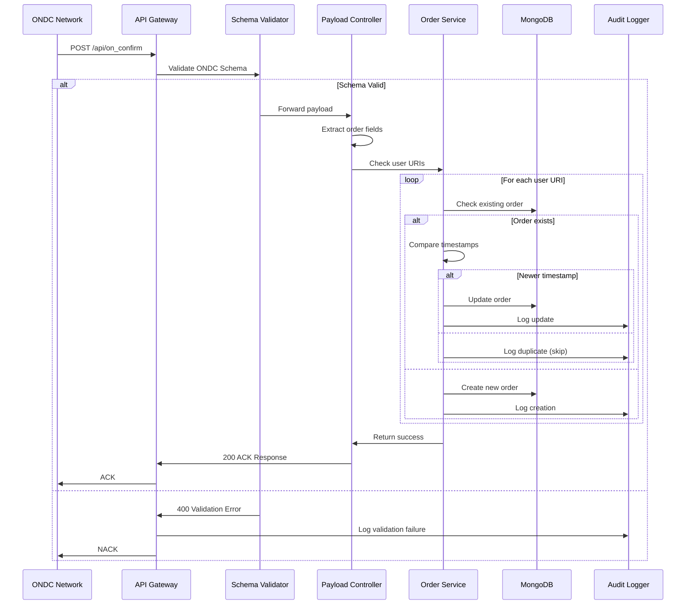
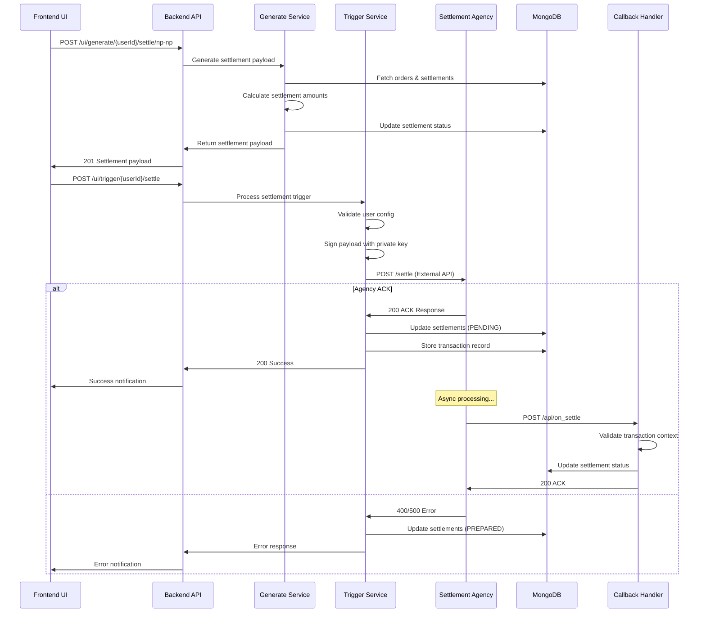
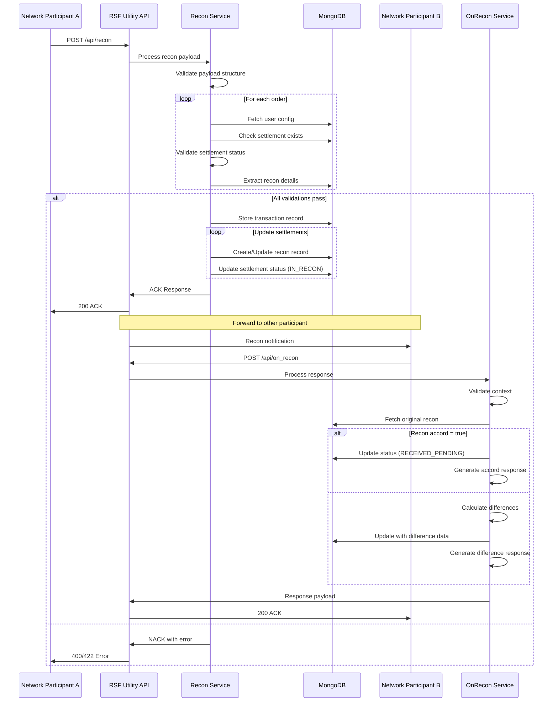
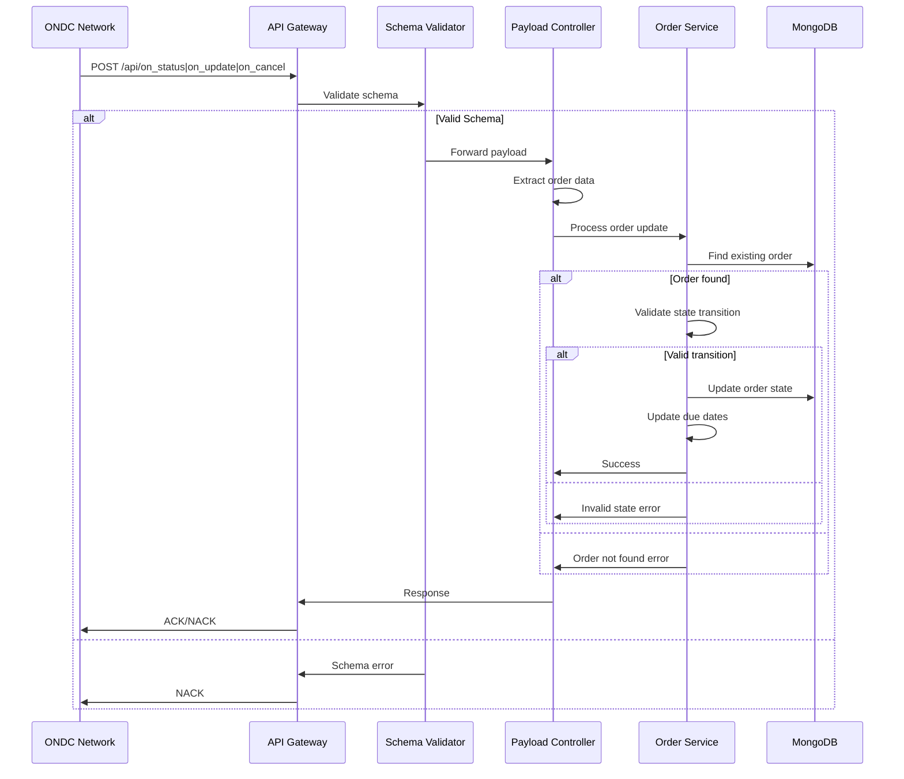
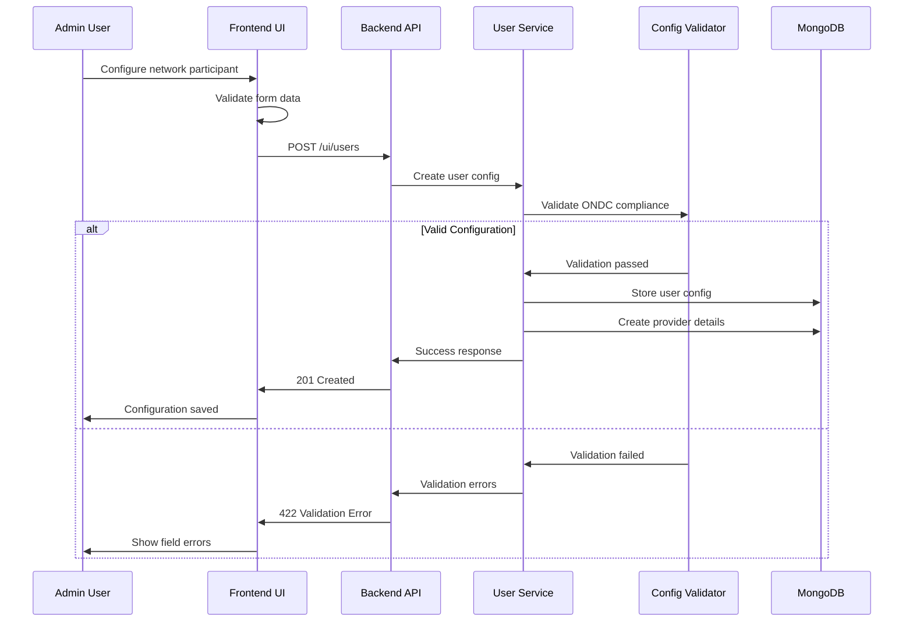
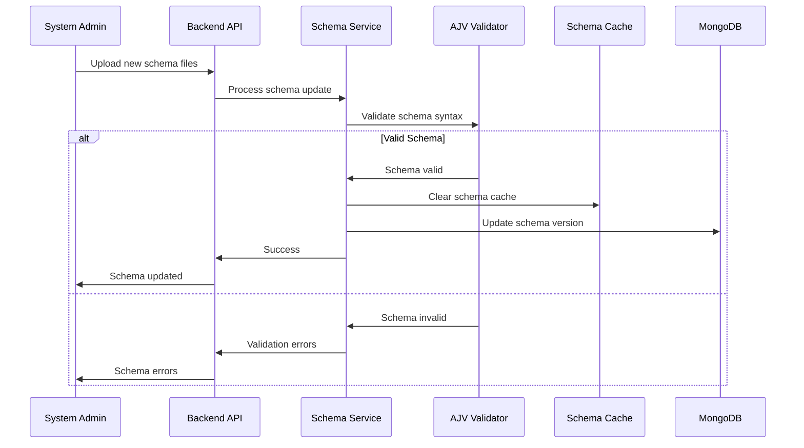
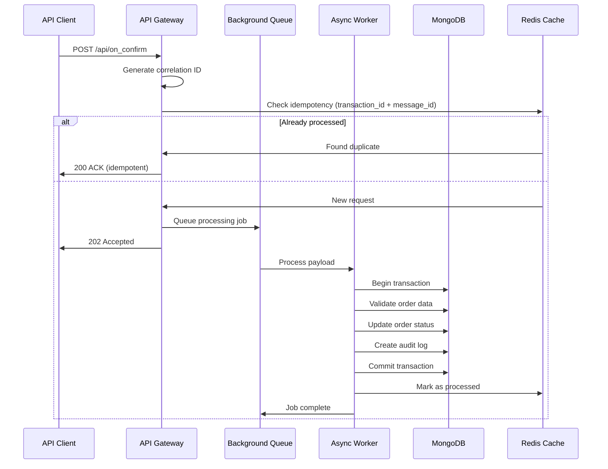

# Workflow Documentation

## System Overview

This document provides end-to-end workflows with sequence diagrams and example payloads for the RSF Utility ONDC settlement and reconciliation system.

## Core Workflows

### 1. Order Confirmation Workflow (`/on_confirm`)

**Purpose**: Process order confirmation from ONDC network participants and store order data for settlement processing.

#### Sequence Diagram



#### Example Payload

```json
{
  "context": {
    "domain": "ONDC:RET14",
    "country": "IND", 
    "city": "std:080",
    "action": "on_confirm",
    "core_version": "1.2.0",
    "bap_id": "buyer-app.ondc.org",
    "bap_uri": "https://buyer-app.ondc.org/protocol/v1",
    "bpp_id": "seller-app.ondc.org", 
    "bpp_uri": "https://seller-app.ondc.org/protocol/v1",
    "transaction_id": "3937483r-75i6-4629-ba81-3e2f9c7c1234",
    "message_id": "bb579fb8-cb82-4824-be12-fcbc405b6608",
    "timestamp": "2023-02-03T08:00:30.000Z"
  },
  "message": {
    "order": {
      "id": "2023-02-03-876543",
      "state": "Created",
      "provider": {
        "id": "PROVIDER_001",
        "locations": [{"id": "L1"}]
      },
      "items": [
        {
          "id": "ITEM_001",
          "fulfillment_id": "F1",
          "quantity": {"count": 2}
        }
      ],
      "quote": {
        "price": {
          "currency": "INR",
          "value": "372.00"
        },
        "breakup": [
          {
            "@ondc/org/item_id": "ITEM_001",
            "title": "Fresh Apples",
            "price": {"currency": "INR", "value": "340.00"}
          },
          {
            "@ondc/org/item_id": "ITEM_001", 
            "@ondc/org/title_type": "delivery",
            "title": "Delivery charges",
            "price": {"currency": "INR", "value": "32.00"}
          }
        ]
      },
      "payment": {
        "params": {
          "currency": "INR",
          "transaction_id": "txn_1234567890",
          "amount": "372.00"
        },
        "status": "PAID",
        "type": "ON-ORDER",
        "collected_by": "BAP",
        "@ondc/org/buyer_app_finder_fee_type": "percent",
        "@ondc/org/buyer_app_finder_fee_amount": "3.0",
        "@ondc/org/settlement_basis": "delivery",
        "@ondc/org/settlement_window": "P1D"
      },
      "created_at": "2023-02-03T08:00:30.000Z",
      "updated_at": "2023-02-03T08:00:30.000Z"
    }
  }
}
```

#### Error Handling

| Error Code | Condition | Response |
|------------|-----------|----------|
| 400 | Schema validation failure | NACK with field details |
| 422 | Invalid order data | NACK with validation errors |
| 500 | Database connection error | NACK with retry suggestion |
| 409 | Duplicate order (older timestamp) | ACK (ignored) |

---

### 2. Settlement Workflow (`/settle` ↔ `/on_settle`)

**Purpose**: Generate settlement payloads, trigger external settlement agency, and process settlement responses.

#### Sequence Diagram



#### Example Settlement Generation

**Request:**
```json
{
  "settle_data": [
    {
      "order_id": "2023-02-03-876543",
      "provider_value": 150.00,
      "self_value": 25.00
    }
  ]
}
```

**Generated Settlement Payload:**
```json
{
  "context": {
    "domain": "ONDC:NTS10",
    "location": {"country": {"code": "IND"}, "city": {"code": "*"}},
    "version": "2.0.0",
    "action": "settle",
    "bap_id": "buyer-app.ondc.org",
    "bap_uri": "https://buyer-app.ondc.org/protocol/v1",
    "bpp_id": "settlement-agency.ondc.org",
    "bpp_uri": "https://settlement-agency.ondc.org/api",
    "transaction_id": "3937483r-75i6-4629-ba81-3e2f9c7c1234",
    "message_id": "bb579fb8-cb82-4824-be12-fcbc405b6608",
    "timestamp": "2023-02-03T09:00:30.000Z",
    "ttl": "P1D"
  },
  "message": {
    "collector_app_id": "buyer-app.ondc.org",
    "receiver_app_id": "seller-app.ondc.org",
    "settlement": {
      "type": "NP-NP",
      "id": "settlement_001",
      "orders": [
        {
          "id": "2023-02-03-876543",
          "inter_participant": {
            "settled_amount": {"currency": "INR", "value": "197.00"},
            "amount": {"currency": "INR", "value": "372.00"}
          },
          "collector": {
            "amount": {"currency": "INR", "value": "25.00"}
          },
          "provider": {
            "id": "PROVIDER_001",
            "name": "Fresh Fruits Store",
            "amount": {"currency": "INR", "value": "150.00"}
          },
          "self": {
            "amount": {"currency": "INR", "value": "25.00"}
          }
        }
      ]
    }
  }
}
```

#### Example on_settle Response

```json
{
  "context": {
    "domain": "ONDC:NTS10",
    "action": "on_settle",
    "version": "2.0.0",
    "bap_id": "buyer-app.ondc.org",
    "bap_uri": "https://buyer-app.ondc.org/protocol/v1",
    "bpp_id": "settlement-agency.ondc.org",
    "bpp_uri": "https://settlement-agency.ondc.org/api",
    "transaction_id": "3937483r-75i6-4629-ba81-3e2f9c7c1234",
    "message_id": "bb579fb8-cb82-4824-be12-fcbc405b6608",
    "timestamp": "2023-02-03T09:30:30.000Z"
  },
  "message": {
    "settlement": {
      "id": "settlement_001",
      "orders": [
        {
          "id": "2023-02-03-876543",
          "inter_participant": {
            "status": "SETTLED",
            "reference_no": "SETT_REF_001"
          },
          "self": {
            "status": "SETTLED", 
            "reference_no": "SELF_REF_001"
          },
          "provider": {
            "status": "SETTLED",
            "reference_no": "PROV_REF_001"
          }
        }
      ]
    }
  }
}
```

---

### 3. Reconciliation Workflow (`/recon` ↔ `/on_recon`)

**Purpose**: Handle reconciliation requests and responses for settlement discrepancies.

#### Sequence Diagram



#### Example Recon Request

```json
{
  "context": {
    "domain": "ONDC:NTS10",
    "location": {"country": {"code": "IND"}, "city": {"code": "*"}},
    "version": "2.0.0", 
    "action": "recon",
    "bap_id": "buyer-app.ondc.org",
    "bap_uri": "https://buyer-app.ondc.org/protocol/v1",
    "bpp_id": "seller-app.ondc.org",
    "bpp_uri": "https://seller-app.ondc.org/protocol/v1",
    "transaction_id": "recon_txn_001",
    "message_id": "recon_msg_001",
    "timestamp": "2023-02-03T10:00:30.000Z",
    "ttl": "P1D"
  },
  "message": {
    "orders": [
      {
        "id": "2023-02-03-876543",
        "amount": {"currency": "INR", "value": "372.00"},
        "settlements": [
          {
            "id": "settlement_001",
            "payment_id": "pymnt_001",
            "status": "PENDING",
            "amount": {"currency": "INR", "value": "197.00"},
            "commission": {"currency": "INR", "value": "11.16"},
            "withholding_amount": {"currency": "INR", "value": "37.20"},
            "tcs": {"currency": "INR", "value": "5.91"},
            "tds": {"currency": "INR", "value": "11.82"},
            "updated_at": "2023-02-03T09:30:30.000Z"
          }
        ]
      }
    ]
  }
}
```

#### Example on_recon Response (With Disagreement)

```json
{
  "context": {
    "domain": "ONDC:NTS10",
    "action": "on_recon",
    "version": "2.0.0",
    "bap_id": "buyer-app.ondc.org",
    "bap_uri": "https://buyer-app.ondc.org/protocol/v1", 
    "bpp_id": "seller-app.ondc.org",
    "bpp_uri": "https://seller-app.ondc.org/protocol/v1",
    "transaction_id": "recon_txn_001",
    "message_id": "recon_msg_001",
    "timestamp": "2023-02-03T10:30:30.000Z"
  },
  "message": {
    "orders": [
      {
        "id": "2023-02-03-876543",
        "amount": {"currency": "INR", "value": "372.00"},
        "recon_accord": false,
        "settlements": [
          {
            "id": "settlement_001",
            "status": "PENDING",
            "amount": {
              "currency": "INR",
              "value": "200.00",
              "diff_value": "3.00"
            },
            "commission": {
              "currency": "INR", 
              "value": "12.00",
              "diff_value": "0.84"
            },
            "withholding_amount": {
              "currency": "INR",
              "value": "40.00", 
              "diff_value": "2.80"
            },
            "tcs": {
              "currency": "INR",
              "value": "6.00",
              "diff_value": "0.09"
            },
            "tds": {
              "currency": "INR",
              "value": "12.00",
              "diff_value": "0.18"
            },
            "updated_at": "2023-02-03T10:30:30.000Z"
          }
        ]
      }
    ]
  }
}
```

---

### 4. Order Status Update Workflow (`/on_status`, `/on_update`, `/on_cancel`)

**Purpose**: Process order lifecycle updates from ONDC network.

#### Sequence Diagram



#### Example on_status Payload

```json
{
  "context": {
    "domain": "ONDC:RET14",
    "action": "on_status", 
    "core_version": "1.2.0",
    "bap_id": "buyer-app.ondc.org",
    "bap_uri": "https://buyer-app.ondc.org/protocol/v1",
    "bpp_id": "seller-app.ondc.org",
    "bpp_uri": "https://seller-app.ondc.org/protocol/v1",
    "transaction_id": "3937483r-75i6-4629-ba81-3e2f9c7c1234",
    "message_id": "status_msg_001",
    "timestamp": "2023-02-03T12:00:30.000Z"
  },
  "message": {
    "order": {
      "id": "2023-02-03-876543",
      "state": "In-progress",
      "fulfillments": [
        {
          "id": "F1",
          "state": {
            "descriptor": {"code": "Order-picked-up"}
          },
          "tracking": true
        }
      ],
      "updated_at": "2023-02-03T12:00:30.000Z"
    }
  }
}
```

---

### 5. Admin Operations Workflow

**Purpose**: Administrative configuration, user management, and system maintenance.

#### Configuration Bootstrap Sequence



#### Example User Configuration

```json
{
  "title": "FRESH_FRUITS_STORE",
  "role": "BPP",
  "domain": "ONDC:RET14", 
  "subscriber_url": "https://fresh-fruits.ondc.org/protocol/v1",
  "np_tcs": 3.0,
  "np_tds": 6.0,
  "pr_tcs": 9.0,
  "pr_tds": 3.0,
  "tcs_applicability": "BOTH",
  "tds_applicability": "BOTH",
  "msn": false,
  "provider_details": [
    {
      "provider_name": "Fresh Fruits Store",
      "provider_id": "PROVIDER_001", 
      "account_number": "1234567890",
      "ifsc_code": "ICIC0001234",
      "bank_name": "ICICI Bank"
    }
  ],
  "counterparty_infos": []
}
```

#### Schema Update Workflow



---

### 6. Async Transaction Processing & Idempotency

**Purpose**: Handle background transaction processing with idempotency guarantees.

#### Async Processing Sequence



#### Idempotency Implementation

**Key Components:**
- **Correlation ID**: `context.transaction_id + context.message_id`
- **Idempotency Window**: 24 hours (configurable)
- **Storage**: Redis cache with MongoDB fallback
- **Retry Logic**: Exponential backoff for failed jobs

**Example Implementation:**
```typescript
async function processWithIdempotency(payload: any) {
  const key = `${payload.context.transaction_id}_${payload.context.message_id}`;
  
  // Check if already processed
  const existing = await redis.get(key);
  if (existing) {
    return JSON.parse(existing); // Return cached result
  }
  
  // Process transaction
  const result = await processTransaction(payload);
  
  // Cache result for 24 hours
  await redis.setex(key, 86400, JSON.stringify(result));
  
  return result;
}
```

#### Error Handling & Retry Strategy

| Error Type | Retry Strategy | Max Attempts | Backoff |
|------------|----------------|--------------|---------|
| Network timeout | Exponential | 5 | 1s, 2s, 4s, 8s, 16s |
| Database deadlock | Linear | 3 | 1s, 2s, 3s |
| Schema validation | No retry | 1 | N/A |
| Business logic error | No retry | 1 | N/A |

---

## Integration Patterns

### Error Response Format

All API endpoints follow standardized error responses:

```json
{
  "success": false,
  "error": {
    "code": "VALIDATION_FAILED",
    "message": "Schema validation failed",
    "details": {
      "field": "message.order.id",
      "reason": "required field missing"
    }
  }
}
```

### Success Response Format

```json
{
  "success": true,
  "data": {
    // Payload data
  },
  "message": "Operation completed successfully"
}
```

### Correlation & Tracing

- **Request ID**: Generated for each API call
- **Transaction ID**: ONDC protocol transaction identifier  
- **Message ID**: ONDC protocol message identifier
- **User Context**: User ID and role for audit trails

### Monitoring Integration

- **Prometheus Metrics**: Request rates, error rates, processing times
- **Structured Logging**: JSON format with correlation IDs
- **Health Checks**: Database connectivity, external service status
- **Alerts**: Critical error thresholds, processing delays

### Security & Authentication

- **JWT Tokens**: Client-ID based authentication
- **Digital Signatures**: RSF payload signing for external APIs
- **Rate Limiting**: Per-client request throttling
- **Input Validation**: Schema validation for all payloads

This comprehensive workflow documentation provides the foundation for understanding, implementing, and troubleshooting the RSF Utility system operations.
