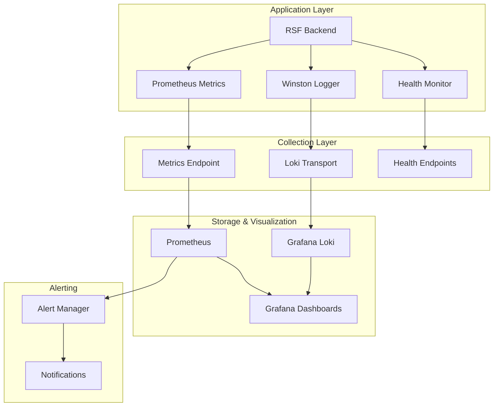

# Operations & Observability Guide

*Comprehensive guide for monitoring, logging, incident response, and operational procedures for RSF Utility*

---

## Table of Contents

1. [Overview](#overview)
2. [Logging Framework](#logging-framework)
3. [Metrics Collection](#metrics-collection)
4. [Health Monitoring](#health-monitoring)
5. [Incident Response](#incident-response)
6. [Backup & Recovery](#backup--recovery)
7. [Monitoring Dashboards](#monitoring-dashboards)
8. [Troubleshooting Runbooks](#troubleshooting-runbooks)
9. [Alerting Configuration](#alerting-configuration)
10. [Performance Optimization](#performance-optimization)

---

## Overview

RSF Utility implements a comprehensive observability stack designed for production environments. The system provides real-time monitoring, structured logging, automated health checks, and detailed metrics collection to ensure reliable operation of the ONDC settlement framework.

### Observability Stack Components



### Key Features

- **Structured Logging**: JSON-formatted logs with correlation IDs
- **Real-time Metrics**: Prometheus metrics for system and business KPIs
- **Health Monitoring**: Automated health checks for all components
- **Request Tracing**: End-to-end request tracking across services
- **Incident Response**: Automated alerting and runbook procedures
- **Backup Automation**: Scheduled database backups with retention policies

---

## Logging Framework

### Winston Logger Configuration

RSF Utility uses a sophisticated logging system built on Winston with environment-specific configurations and comprehensive audit capabilities:

#### Logger Implementation
**Source**: `src/utils/logger/winston/AutomationLogger.ts`

```typescript
// AutomationLogger class structure
class AutomationLogger {
  private logger: winston.Logger;
  private correlationId: string;
  
  constructor(correlationId?: string) {
    this.correlationId = correlationId || generateCorrelationId();
    this.setupLogger();
  }
  
  private setupLogger() {
    const transports = [];
    
    // Development: Console transport with colorization
    if (process.env.NODE_ENV === 'development') {
      transports.push(new winston.transports.Console({
        format: combine(
          colorize({ all: true }),
          timestamp({ format: "YYYY-MM-DD hh:mm:ss.SSS A" }),
          splat(),
          errors({ stack: true }),
          devFormat  // Custom development formatting
        )
      }));
    }
    
    // Production: Loki transport for centralized logging
    if (process.env.NODE_ENV === 'production' && process.env.LOKI_HOST) {
      transports.push(new LokiTransport({
        host: process.env.LOKI_HOST,
        labels: { 
          app: 'rsf-utility',
          environment: process.env.NODE_ENV 
        },
        format: combine(
          timestamp({ format: "YYYY-MM-DD hh:mm:ss.SSS A" }),
          splat(),
          json(),
          errors({ stack: true })
        )
      }));
    }
    
    this.logger = winston.createLogger({
      level: process.env.LOG_LEVEL || 'info',
      transports,
      defaultMeta: { 
        correlationId: this.correlationId,
        service: 'rsf-utility'
      }
    });
  }
}
```

#### Log Formats and Transports

**Development Format** (`src/utils/logger/winston/format.ts`):
```typescript
export const devFormat = combine(
  colorize({ all: true }),
  timestamp({ format: "YYYY-MM-DD hh:mm:ss.SSS A" }),
  splat(),
  errors({ stack: true }),
  printf((info) => {
    const { timestamp, level, message, stack, scope, ...meta } = info;
    
    // Pretty-print objects with colors
    const metaString = Object.entries(meta)
      .map(([key, value]) => {
        if (typeof value === "object") {
          return `${key}: ${inspect(value, { colors: true, depth: Infinity })}`;
        }
        return `${key}: ${value}`;
      })
      .join("\n");

    // Colorize scope information
    let scopeString = "";
    if (scope) {
      scopeString = `\x1b[36mscope: ${scope}\x1b[0m\n`;
    }

    // Handle errors with stack traces
    if (stack) {
      return `----------\n${timestamp} ${message}\n${scopeString}${metaString}\n${stack}`;
    }

    return `----------\n${timestamp} ${message}\n${scopeString}${metaString}`;
  })
);
```

**Production Format** (Loki Integration):
```typescript
export const lokiFormat = combine(
  timestamp({ format: "YYYY-MM-DD hh:mm:ss.SSS A" }),
  splat(),
  json(),
  errors({ stack: true })
);
```

#### Specialized Logging Components

**Request/Response Logging** (`src/middlewares/request-log.ts`):
```typescript
export const requestLogger = (req: Request, res: Response, next: NextFunction) => {
  const correlationId = generateCorrelationId();
  req.correlationId = correlationId;
  
  const logger = new AutomationLogger(correlationId);
  
  logger.info('Incoming request', {
    method: req.method,
    url: req.url,
    body: req.body,
    query: req.query,
    params: req.params,
    headers: req.headers,
    userAgent: req.get('User-Agent'),
    ip: req.ip
  });
  
  next();
};
```

**Response Logging** (`src/middlewares/response-log.ts`):
```typescript
export const responseLogger = (req: Request, res: Response, next: NextFunction) => {
  const logger = new AutomationLogger(req.correlationId);
  
  const originalSend = res.send;
  res.send = function(body) {
    logger.info('Outgoing response', {
      statusCode: res.statusCode,
      responseBody: body,
      headers: res.getHeaders(),
      processingTime: Date.now() - req.startTime
    });
    
    return originalSend.call(this, body);
  };
  
  next();
};
```

**RSF Audit Logging** (`src/middlewares/rsf-audit-logger.ts`):
```typescript
export const rsfAuditLogger = (req: Request, res: Response, next: NextFunction) => {
  const logger = new AutomationLogger(req.correlationId);
  
  // Log RSF-specific operations
  if (req.url.includes('/api/') || req.url.includes('/ui/')) {
    logger.info('RSF Operation', {
      operation: req.url,
      method: req.method,
      timestamp: new Date().toISOString(),
      participant: req.body?.context?.bap_id || req.body?.context?.bpp_id,
      transactionId: req.body?.context?.transaction_id,
      messageId: req.body?.context?.message_id,
      action: req.body?.context?.action
    });
  }
  
  next();
};
```

#### Log Levels and Usage

**Configured Log Levels**:
```typescript
const logLevels = {
  error: 0,    // System errors, exceptions, critical failures
  warn: 1,     // Warning conditions, deprecated usage, potential issues  
  info: 2,     // General operational logs, business events
  debug: 3     // Detailed debugging information, request/response details
};
```

**Usage Examples**:
```typescript
const logger = new AutomationLogger();

// Error logging with context
logger.error('Settlement processing failed', {
  settlementId: 'settlement-123',
  orderId: 'order-456',
  error: error.message,
  stack: error.stack,
  participantId: 'participant-789'
});

// Info logging for business events
logger.info('Settlement generated successfully', {
  settlementId: 'settlement-123',
  totalAmount: 1500.50,
  ordersCount: 25,
  participantId: 'participant-789'
});

// Debug logging for detailed tracing
logger.debug('Database query executed', {
  collection: 'orders',
  query: { user_id: 'user-123', status: 'READY' },
  results: 42,
  executionTime: '15ms'
});
```
      transports.push(new LokiTransport({
        host: process.env.LOKI_HOST,
        labels: { job: 'rsf-utility' },
        json: true,
        format: winston.format.json(),
        batching: true,
        interval: 5000
      }));
    }
    
    this.logger = winston.createLogger({
      level: process.env.LOG_LEVEL || 'info',
      transports
    });
  }
}
```

### Log Levels & Structure

#### Log Level Hierarchy
```plaintext
DEBUG → INFO → WARN → ERROR

debug: Detailed debugging information, request/response bodies
info:  General operational information, successful operations
warn:  Warning conditions, recoverable errors, timeouts
error: Error conditions, failed operations, exceptions
```

#### Structured Log Format
```json
{
  "timestamp": "2024-01-15T10:30:45.123Z",
  "level": "info",
  "message": "Settlement request processed",
  "correlationId": "req_1704192645123_abc123",
  "userId": "user_12345",
  "operation": "settle_request",
  "duration": 1250,
  "metadata": {
    "orderId": "order_67890",
    "amount": 1500.00,
    "status": "success"
  }
}
```

### Correlation ID Implementation

```typescript
// Correlation ID middleware for request tracking
export const correlationIdMiddleware = (req: Request, res: Response, next: NextFunction) => {
  const correlationId = req.headers['x-correlation-id'] as string || 
                       `req_${Date.now()}_${Math.random().toString(36).substr(2, 9)}`;
  
  req.correlationId = correlationId;
  res.setHeader('x-correlation-id', correlationId);
  
  // Attach to request context for downstream logging
  req.logger = new AutomationLogger(correlationId);
  
  next();
};
```

### Log Categories

#### Audit Logs
```json
{
  "type": "audit",
  "event": "user_authentication",
  "user": "user_12345",
  "action": "login_success",
  "ipAddress": "192.168.1.100",
  "userAgent": "Mozilla/5.0...",
  "timestamp": "2024-01-15T10:30:45.123Z"
}
```

#### Business Logic Logs
```json
{
  "type": "business",
  "workflow": "settlement_processing",
  "stage": "validation_complete",
  "orderId": "order_67890",
  "validationResult": "passed",
  "nextStage": "payment_initiation"
}
```

#### System Logs
```json
{
  "type": "system",
  "component": "database",
  "event": "connection_restored",
  "dbHost": "mongodb://localhost:27017",
  "downtime": "45s"
}
```

---

## Metrics Collection

### Prometheus Metrics Configuration

RSF Utility exposes comprehensive metrics through Prometheus client at `/metrics` endpoint:

```typescript
// Metrics definition and collection
import promClient from 'prom-client';

// System Performance Metrics
const systemCpuUsage = new promClient.Gauge({
  name: 'system_cpu_usage_percent',
  help: 'Current CPU usage percentage',
  labelNames: ['instance']
});

const systemMemoryUsage = new promClient.Gauge({
  name: 'system_memory_usage_percent', 
  help: 'Current memory usage percentage',
  labelNames: ['instance']
});

// Database Health Metrics
const dbHealthStatus = new promClient.Gauge({
  name: 'db_health_status',
  help: 'Database connection status (1=healthy, 0=unhealthy)',
  labelNames: ['database', 'instance']
});

const dbLatencyGauge = new promClient.Gauge({
  name: 'db_operation_latency_ms',
  help: 'Database operation latency in milliseconds',
  labelNames: ['operation', 'collection']
});

// Business Metrics
const settlementRequestsTotal = new promClient.Counter({
  name: 'settlement_requests_total',
  help: 'Total number of settlement requests processed',
  labelNames: ['status', 'user_type']
});

const reconciliationProcessingTime = new promClient.Histogram({
  name: 'reconciliation_processing_duration_seconds',
  help: 'Time taken to process reconciliation requests',
  buckets: [0.1, 0.5, 1, 2, 5, 10, 30, 60]
});
```

### Business KPI Metrics

#### Settlement Operations
```typescript
// Settlement success rate
const settlementSuccessRate = new promClient.Gauge({
  name: 'settlement_success_rate_percent',
  help: 'Percentage of successful settlements in last hour',
  collect() {
    // Calculate from recent settlement attempts
    this.set(calculateSettlementSuccessRate());
  }
});

// Settlement processing volume
const settlementVolume = new promClient.Counter({
  name: 'settlement_volume_total',
  help: 'Total settlement amount processed',
  labelNames: ['currency', 'agency']
});
```

#### Reconciliation Metrics
```typescript
// Reconciliation accuracy
const reconciliationAccuracy = new promClient.Gauge({
  name: 'reconciliation_accuracy_percent',
  help: 'Percentage of reconciliations with zero discrepancy'
});

// Discrepancy amounts
const discrepancyAmounts = new promClient.Histogram({
  name: 'reconciliation_discrepancy_amount',
  help: 'Distribution of reconciliation discrepancy amounts',
  buckets: [0, 1, 5, 10, 50, 100, 500, 1000]
});
```

### Metrics Collection Schedule

```typescript
// Automated metrics collection every 30 seconds
setInterval(() => {
  // System metrics
  systemCpuUsage.set(os.loadavg()[0] * 100);
  systemMemoryUsage.set((1 - os.freemem() / os.totalmem()) * 100);
  
  // Database health
  dbHealthStatus.set(mongooseConnection.readyState);
  
  // Application metrics
  collectBusinessMetrics();
}, 30000);
```

---

## Health Monitoring

### Health Monitor Class

```typescript
// Comprehensive health monitoring system
class HealthMonitor {
  private healthStatus: HealthStatus = {
    overall: 'healthy',
    services: {},
    lastCheck: new Date(),
    uptime: process.uptime()
  };
  
  async performHealthCheck(): Promise<HealthStatus> {
    const checks = await Promise.allSettled([
      this.checkDatabase(),
      this.checkExternalServices(),
      this.checkSystemResources(),
      this.checkBusinessLogic()
    ]);
    
    this.updateHealthStatus(checks);
    return this.healthStatus;
  }
  
  private async checkDatabase(): Promise<ServiceHealth> {
    try {
      const start = Date.now();
      await mongoose.connection.db.admin().ping();
      const latency = Date.now() - start;
      
      dbLatencyGauge.set(latency);
      dbHealthStatus.set(1);
      
      return {
        status: 'healthy',
        latency,
        lastCheck: new Date()
      };
    } catch (error) {
      dbHealthStatus.set(0);
      return {
        status: 'unhealthy',
        error: error.message,
        lastCheck: new Date()
      };
    }
  }
  
  private async checkSystemResources(): Promise<ServiceHealth> {
    const cpuUsage = os.loadavg()[0] * 100;
    const memoryUsage = (1 - os.freemem() / os.totalmem()) * 100;
    const diskUsage = await this.getDiskUsage();
    
    const status = cpuUsage > 90 || memoryUsage > 90 || diskUsage > 90 
      ? 'unhealthy' : 'healthy';
    
    return {
      status,
      metrics: { cpuUsage, memoryUsage, diskUsage },
      lastCheck: new Date()
    };
  }
}
```

### Health Check Endpoints

```typescript
// Health endpoints exposed for monitoring
app.get('/health', (req, res) => {
  const healthStatus = healthMonitor.getOverallHealth();
  const statusCode = healthStatus.overall === 'healthy' ? 200 : 503;
  
  res.status(statusCode).json({
    status: healthStatus.overall,
    timestamp: new Date().toISOString(),
    uptime: process.uptime(),
    version: process.env.npm_package_version
  });
});

app.get('/ui/health/db', async (req, res) => {
  const dbHealth = await healthMonitor.checkDatabase();
  const statusCode = dbHealth.status === 'healthy' ? 200 : 503;
  
  res.status(statusCode).json({
    status: dbHealth.status,
    latency: dbHealth.latency,
    timestamp: dbHealth.lastCheck
  });
});

app.get('/health/detailed', async (req, res) => {
  const detailedHealth = await healthMonitor.performHealthCheck();
  const statusCode = detailedHealth.overall === 'healthy' ? 200 : 503;
  
  res.status(statusCode).json(detailedHealth);
});
```

### Automated Health Check Script

The comprehensive health check script (`deploy/scripts/health-check.sh`) provides:

```bash
#!/bin/bash
# RSF Utility Health Check Script

# Configuration
BACKEND_URL="${BACKEND_URL:-http://localhost:3000}"
FRONTEND_URL="${FRONTEND_URL:-http://localhost:6500}"
MONGODB_HOST="${MONGODB_HOST:-localhost:27017}"
TIMEOUT="${TIMEOUT:-30}"

# Main health check function
main() {
    log "Starting RSF Utility health check..."
    
    local overall_healthy=true
    
    # Comprehensive health checks
    check_backend || overall_healthy=false
    check_frontend || overall_healthy=false
    check_mongodb || overall_healthy=false
    check_containers || overall_healthy=false
    check_resources
    check_api_functionality || overall_healthy=false
    
    show_status_summary
    
    if [[ "$overall_healthy" == true ]]; then
        log "✅ Overall health check passed"
        exit 0
    else
        error "❌ Overall health check failed"
        exit 1
    fi
}

# Resource monitoring
check_resources() {
    log "=== System Resources Check ==="
    
    # Disk space check
    local disk_usage=$(df / | awk 'NR==2 {print $5}' | sed 's/%//')
    [[ "$disk_usage" -lt 90 ]] && 
        log "✅ Disk usage: ${disk_usage}% (healthy)" ||
        warning "⚠️  Disk usage: ${disk_usage}% (high)"
    
    # Memory usage check
    if command -v free &> /dev/null; then
        local mem_usage=$(free | awk 'NR==2{printf "%.0f", $3*100/$2}')
        [[ "$mem_usage" -lt 90 ]] &&
            log "✅ Memory usage: ${mem_usage}% (healthy)" ||
            warning "⚠️  Memory usage: ${mem_usage}% (high)"
    fi
}
```

---

## Incident Response

### Incident Classification

#### Severity Levels

**P0 - Critical (< 15 minutes response)**
- Complete system outage
- Database unavailable
- Payment processing failures
- Security breaches

**P1 - High (< 1 hour response)**
- Partial system degradation
- Settlement processing delays
- Reconciliation failures
- Performance degradation > 50%

**P2 - Medium (< 4 hours response)**
- Minor feature issues
- Non-critical API endpoint failures
- Logging or monitoring issues

**P3 - Low (< 24 hours response)**
- Documentation issues
- Minor UI bugs
- Enhancement requests

### Incident Response Procedures

#### P0 Critical Incident Response

```bash
# Immediate Response (< 5 minutes)
1. Acknowledge alert in monitoring system
2. Execute emergency health check:
   ./deploy/scripts/health-check.sh
3. Check system status:
   docker-compose ps
   docker-compose logs -f --tail=100
4. Notify incident team via configured channels

# Investigation Phase (5-15 minutes)
1. Identify root cause:
   # Check recent deployments
   git log --oneline -10
   
   # Check system resources
   docker stats
   
   # Check database connectivity
   docker exec rsf_mongodb mongosh --eval "db.runCommand({ping: 1})"
   
   # Check application logs
   docker logs rsf_backend | grep -i error | tail -20

2. Implement immediate mitigation:
   # Restart services if needed
   docker-compose restart rsf_backend
   
   # Scale resources if available
   docker-compose up -d --scale rsf-backend=2
   
   # Enable maintenance mode if required
   # (Implementation depends on load balancer configuration)
```

#### Service Recovery Procedures

```bash
# Database Recovery
if [[ $(docker exec rsf_mongodb mongosh --quiet --eval "db.runCommand({ping: 1}).ok") != "1" ]]; then
    echo "MongoDB recovery initiated"
    
    # Check container status
    docker-compose ps mongodb
    
    # Restart MongoDB if needed
    docker-compose restart rsf_mongodb
    
    # Wait for recovery
    timeout 60 bash -c 'until docker exec rsf_mongodb mongosh --quiet --eval "db.runCommand({ping: 1}).ok" | grep -q "1"; do sleep 2; done'
    
    # Verify data integrity
    docker exec rsf_mongodb mongosh --eval "
        use rsf-utility;
        db.users.countDocuments();
        db.orders.countDocuments();
        db.settlements.countDocuments();
    "
fi

# Application Recovery
if ! curl -f http://localhost:3000/health > /dev/null 2>&1; then
    echo "Backend recovery initiated"
    
    # Check container logs
    docker logs rsf_backend --tail=50
    
    # Restart backend service
    docker-compose restart rsf_backend
    
    # Wait for startup
    timeout 120 bash -c 'until curl -f http://localhost:3000/health > /dev/null 2>&1; do sleep 5; done'
    
    # Verify functionality
    curl -X POST http://localhost:3000/ui/auth/sign-token \
         -H "Content-Type: application/json" \
         -d '{"clientId": "health-check"}'
fi
```

### Communication Templates

#### Incident Notification Template
```
INCIDENT ALERT - [SEVERITY] [SYSTEM]

Incident ID: INC-{timestamp}
Severity: P{0-3}
System: RSF Utility
Component: {affected-component}

Description: {brief-description}
Impact: {user-impact}
Status: INVESTIGATING

Actions Taken:
- {action-1}
- {action-2}

Next Update: {time}
Incident Lead: {name}
```

#### Status Update Template
```
INCIDENT UPDATE - INC-{incident-id}

Status: {INVESTIGATING|MITIGATING|RESOLVED}
Time Since Start: {duration}

Progress:
- {update-1}  
- {update-2}

Current Impact: {current-impact}
ETA to Resolution: {eta}

Next Update: {time}
```

---

## Backup & Recovery

### Database Backup Strategy

#### Automated Backup Script

```bash
#!/bin/bash
# Automated MongoDB backup with retention policy

# Configuration
DATE=$(date +%Y%m%d_%H%M%S)
BACKUP_DIR="${BACKUP_STORAGE_PATH:-/backups/mongodb}"
CONTAINER_NAME="rsf_mongodb"
RETENTION_DAYS="${BACKUP_RETENTION_DAYS:-30}"
DB_NAME="rsf-utility"

# Logging functions
log() { echo "[$(date +'%Y-%m-%d %H:%M:%S')] $1"; }
error() { echo "[ERROR] $1" >&2; }

# Create backup function
create_backup() {
    log "Starting backup for database: $DB_NAME"
    
    # Ensure backup directory exists
    mkdir -p "$BACKUP_DIR"
    
    # Create database dump
    if docker exec "$CONTAINER_NAME" mongodump \
        --db "$DB_NAME" \
        --out "/tmp/backup_$DATE" \
        --quiet; then
        log "Database dump created successfully"
    else
        error "Failed to create database dump"
        exit 1
    fi
    
    # Extract backup from container
    if docker cp "$CONTAINER_NAME:/tmp/backup_$DATE" "$BACKUP_DIR/"; then
        log "Backup extracted from container"
    else
        error "Failed to extract backup"
        exit 1
    fi
    
    # Compress backup
    if tar -czf "$BACKUP_DIR/rsf_backup_$DATE.tar.gz" \
        -C "$BACKUP_DIR" "backup_$DATE"; then
        log "Backup compressed successfully"
    else
        error "Failed to compress backup"
        exit 1
    fi
    
    # Cleanup temporary files
    rm -rf "$BACKUP_DIR/backup_$DATE"
    docker exec "$CONTAINER_NAME" rm -rf "/tmp/backup_$DATE"
    
    # Verify backup integrity
    if tar -tzf "$BACKUP_DIR/rsf_backup_$DATE.tar.gz" > /dev/null; then
        log "Backup verification successful: rsf_backup_$DATE.tar.gz"
    else
        error "Backup verification failed"
        exit 1
    fi
}

# Cleanup old backups
cleanup_old_backups() {
    log "Cleaning up backups older than $RETENTION_DAYS days"
    
    if find "$BACKUP_DIR" -name "rsf_backup_*.tar.gz" \
        -mtime +$RETENTION_DAYS -delete 2>/dev/null; then
        log "Old backup cleanup completed"
    else
        log "No old backups found or cleanup failed"
    fi
}

# Main execution
main() {
    log "=== RSF Utility Database Backup Started ==="
    
    # Verify prerequisites
    if ! docker ps | grep -q "$CONTAINER_NAME"; then
        error "MongoDB container '$CONTAINER_NAME' not running"
        exit 1
    fi
    
    # Perform backup
    create_backup
    cleanup_old_backups
    
    log "=== Backup Process Completed Successfully ==="
    log "Backup location: $BACKUP_DIR/rsf_backup_$DATE.tar.gz"
}

# Execute main function
main "$@"
```

#### Backup Automation with Cron

```bash
# Crontab entry for daily backups at 2 AM
0 2 * * * /path/to/rsf-utility/deploy/scripts/backup.sh >> /var/log/rsf-backup.log 2>&1

# Weekly full system backup (Sundays at 1 AM)
0 1 * * 0 /path/to/rsf-utility/deploy/scripts/full-backup.sh >> /var/log/rsf-full-backup.log 2>&1
```

### Disaster Recovery Procedures

#### Database Restoration

```bash
#!/bin/bash
# Database restoration script

# Configuration
BACKUP_FILE="$1"
CONTAINER_NAME="rsf_mongodb"
DB_NAME="rsf-utility"

# Validation
if [[ -z "$BACKUP_FILE" ]]; then
    echo "Usage: $0 <backup_file.tar.gz>"
    exit 1
fi

if [[ ! -f "$BACKUP_FILE" ]]; then
    echo "Error: Backup file not found: $BACKUP_FILE"
    exit 1
fi

log() { echo "[$(date +'%Y-%m-%d %H:%M:%S')] $1"; }

# Restoration process
restore_database() {
    log "Starting database restoration from: $BACKUP_FILE"
    
    # Extract backup
    TEMP_DIR=$(mktemp -d)
    tar -xzf "$BACKUP_FILE" -C "$TEMP_DIR"
    
    # Copy to container
    docker cp "$TEMP_DIR/backup_"*"/$DB_NAME" "$CONTAINER_NAME:/tmp/restore"
    
    # Stop application services
    log "Stopping application services"
    docker-compose stop rsf_backend rsf_frontend
    
    # Restore database (with drop to replace existing data)
    log "Restoring database: $DB_NAME"
    docker exec "$CONTAINER_NAME" mongorestore \
        --db "$DB_NAME" \
        --drop \
        "/tmp/restore" \
        --quiet
    
    # Verify restoration
    log "Verifying restoration"
    COLLECTIONS=$(docker exec "$CONTAINER_NAME" mongosh "$DB_NAME" \
        --quiet --eval "db.getCollectionNames().length")
    
    if [[ "$COLLECTIONS" -gt 0 ]]; then
        log "Restoration successful: $COLLECTIONS collections restored"
    else
        log "Warning: No collections found after restoration"
    fi
    
    # Cleanup
    rm -rf "$TEMP_DIR"
    docker exec "$CONTAINER_NAME" rm -rf "/tmp/restore"
    
    # Restart services
    log "Restarting application services"
    docker-compose start rsf_backend rsf_frontend
    
    # Wait for services to be ready
    sleep 30
    
    # Verify system health
    if curl -f http://localhost:3000/health > /dev/null 2>&1; then
        log "System health check passed"
    else
        log "Warning: System health check failed"
    fi
    
    log "Database restoration completed"
}

# Execute restoration
restore_database
```

#### Point-in-Time Recovery

```bash
# MongoDB Oplog-based point-in-time recovery
# Note: Requires replica set configuration for oplog availability

#!/bin/bash
RECOVERY_TIME="$1"  # Format: 2024-01-15T14:30:00Z

if [[ -z "$RECOVERY_TIME" ]]; then
    echo "Usage: $0 <recovery-time-utc>"
    exit 1
fi

# Restore from base backup
./restore.sh latest_backup.tar.gz

# Apply oplog entries up to recovery time
docker exec rsf_mongodb mongorestore \
    --oplogReplay \
    --oplogLimit "${RECOVERY_TIME}" \
    /path/to/oplog/dump
```

---

## Monitoring Dashboards

### Grafana Dashboard Configuration

#### System Overview Dashboard

```json
{
  "dashboard": {
    "title": "RSF Utility - System Overview",
    "panels": [
      {
        "title": "System Health Status",
        "type": "stat",
        "targets": [
          {
            "expr": "up{job=\"rsf-utility\"}",
            "legendFormat": "Backend Status"
          }
        ]
      },
      {
        "title": "Request Rate",
        "type": "graph",
        "targets": [
          {
            "expr": "rate(http_requests_total{job=\"rsf-utility\"}[5m])",
            "legendFormat": "{{method}} {{route}}"
          }
        ]
      },
      {
        "title": "Database Operations",
        "type": "graph", 
        "targets": [
          {
            "expr": "rate(db_operations_total{job=\"rsf-utility\"}[5m])",
            "legendFormat": "{{operation}} - {{collection}}"
          }
        ]
      },
      {
        "title": "Settlement Success Rate",
        "type": "stat",
        "targets": [
          {
            "expr": "settlement_success_rate_percent",
            "legendFormat": "Success Rate"
          }
        ]
      }
    ]
  }
}
```

#### Business Metrics Dashboard

```json
{
  "dashboard": {
    "title": "RSF Utility - Business Metrics",
    "panels": [
      {
        "title": "Settlement Volume (24h)",
        "type": "stat",
        "targets": [
          {
            "expr": "increase(settlement_volume_total[24h])",
            "legendFormat": "Total Volume"
          }
        ]
      },
      {
        "title": "Reconciliation Accuracy",
        "type": "gauge",
        "targets": [
          {
            "expr": "reconciliation_accuracy_percent",
            "legendFormat": "Accuracy %"
          }
        ]
      },
      {
        "title": "Processing Times",
        "type": "graph",
        "targets": [
          {
            "expr": "histogram_quantile(0.95, settlement_processing_duration_seconds_bucket)",
            "legendFormat": "95th Percentile"
          },
          {
            "expr": "histogram_quantile(0.50, settlement_processing_duration_seconds_bucket)", 
            "legendFormat": "Median"
          }
        ]
      }
    ]
  }
}
```

### Log Analysis Queries

#### Grafana Loki Queries

```logql
# Error rate analysis
sum(rate({job="rsf-utility"} |= "ERROR" [5m])) by (level)

# Settlement operation tracking
{job="rsf-utility"} | json | operation="settle_request" | line_format "{{.timestamp}} {{.userId}} {{.amount}}"

# Database connection issues
{job="rsf-utility"} | json | component="database" | level="error"

# API response time analysis
{job="rsf-utility"} | json | duration > 1000 | line_format "Slow request: {{.method}} {{.path}} - {{.duration}}ms"

# User activity monitoring
{job="rsf-utility"} | json | type="audit" | event="user_authentication"

# Correlation ID tracing
{job="rsf-utility"} | json | correlationId="req_1704192645123_abc123"
```

### Custom Metrics Collection

```typescript
// Custom business metrics collector
class BusinessMetricsCollector {
  private settlementMetrics = new Map();
  private reconciliationMetrics = new Map();
  
  collectHourlyMetrics() {
    setInterval(async () => {
      await this.updateSettlementMetrics();
      await this.updateReconciliationMetrics();
      await this.updateUserActivityMetrics();
    }, 3600000); // Every hour
  }
  
  private async updateSettlementMetrics() {
    const now = new Date();
    const hourAgo = new Date(now.getTime() - 3600000);
    
    // Settlement success rate
    const settlements = await Settlement.aggregate([
      { $match: { createdAt: { $gte: hourAgo } } },
      { $group: { 
          _id: "$status", 
          count: { $sum: 1 } 
        } 
      }
    ]);
    
    const total = settlements.reduce((sum, s) => sum + s.count, 0);
    const successful = settlements.find(s => s._id === 'completed')?.count || 0;
    const successRate = total > 0 ? (successful / total) * 100 : 0;
    
    settlementSuccessRate.set(successRate);
    
    // Settlement volume
    const volume = await Settlement.aggregate([
      { $match: { 
          createdAt: { $gte: hourAgo },
          status: 'completed' 
        } 
      },
      { $group: { 
          _id: null, 
          totalAmount: { $sum: "$amount" } 
        } 
      }
    ]);
    
    if (volume.length > 0) {
      settlementVolume.inc(volume[0].totalAmount);
    }
  }
}
```

---

## Troubleshooting Runbooks

### Common Issues & Solutions

#### Issue: Database Connection Failures

**Symptoms:**
- Health checks failing with database connectivity errors
- Application logs showing MongoDB connection timeouts
- `db_health_status` metric showing 0

**Diagnosis Steps:**
```bash
# 1. Check MongoDB container status
docker-compose ps mongodb

# 2. Check MongoDB logs
docker-compose logs mongodb | tail -50

# 3. Test direct connection
docker exec rsf_mongodb mongosh --eval "db.runCommand({ping: 1})"

# 4. Check network connectivity
docker exec rsf_backend nc -zv mongodb 27017

# 5. Check MongoDB authentication
docker exec rsf_mongodb mongosh --eval "db.runCommand({connectionStatus: 1})"
```

**Resolution Steps:**
```bash
# Quick fix: Restart MongoDB
docker-compose restart rsf_mongodb

# Wait for startup
sleep 30

# Verify connectivity
./deploy/scripts/health-check.sh -m localhost:27017

# If issue persists, check disk space
df -h

# Check MongoDB configuration
docker exec rsf_mongodb cat /etc/mongod.conf

# Full reset if needed (DATA LOSS WARNING)
docker-compose down
docker volume rm rsf_mongo_data
docker-compose up -d mongodb
```

#### Issue: High Memory Usage

**Symptoms:**
- `system_memory_usage_percent` > 90%
- Application becoming unresponsive
- Container restarts due to OOM kills

**Diagnosis Steps:**
```bash
# 1. Check container memory usage
docker stats

# 2. Check system memory
free -h

# 3. Identify memory-consuming processes
docker exec rsf_backend ps aux --sort=-%mem | head -10

# 4. Check for memory leaks in logs
docker logs rsf_backend | grep -i "memory\|heap\|out of memory"

# 5. MongoDB memory usage
docker exec rsf_mongodb db.runCommand({serverStatus: 1}).mem
```

**Resolution Steps:**
```bash
# 1. Immediate relief - restart high-memory containers
docker-compose restart rsf_backend

# 2. Optimize MongoDB memory usage
docker exec rsf_mongodb mongosh --eval "
  db.runCommand({planCacheClear: 'orders'});
  db.runCommand({planCacheClear: 'settlements'});
"

# 3. Clear application caches if implemented
curl -X POST http://localhost:3000/admin/cache/clear

# 4. Scale horizontally if possible
docker-compose up -d --scale rsf_backend=2

# 5. Long-term: Update resource limits in docker-compose.yml
# deploy:
#   resources:
#     limits:
#       memory: 1G
#     reservations:
#       memory: 512M
```

#### Issue: Settlement Processing Failures

**Symptoms:**
- Settlement requests timing out
- High error rates in settlement operations
- `settlement_success_rate_percent` dropping

**Diagnosis Steps:**
```bash
# 1. Check recent settlement logs
docker logs rsf_backend | grep -i settlement | tail -20

# 2. Check settlement service health
curl http://localhost:3000/ui/health

# 3. Verify external service connectivity
curl -I ${SETTLEMENT_AGENCY_URL}/health

# 4. Check database for stuck settlements
docker exec rsf_mongodb mongosh rsf-utility --eval "
  db.settlements.find({status: 'processing', createdAt: {
    \$lt: new Date(Date.now() - 1800000)
  }}).count()
"

# 5. Check API rate limits
curl -I http://localhost:3000/api/settle/request
```

**Resolution Steps:**
```bash
# 1. Reset stuck settlements
docker exec rsf_mongodb mongosh rsf-utility --eval "
  db.settlements.updateMany(
    {status: 'processing', createdAt: {\$lt: new Date(Date.now() - 1800000)}},
    {\$set: {status: 'failed', error: 'Timeout reset'}}
  )
"

# 2. Restart settlement service
docker-compose restart rsf_backend

# 3. Check external service status
curl ${SETTLEMENT_AGENCY_URL}/status

# 4. Verify authentication tokens
curl -X POST http://localhost:3000/ui/auth/sign-token \
     -H "Content-Type: application/json" \
     -d '{"clientId": "test"}'

# 5. Monitor settlement processing
watch -n 5 'curl -s http://localhost:3000/metrics | grep settlement_'
```

### Performance Optimization Runbooks

#### Database Performance Optimization

```bash
# 1. Check slow queries
docker exec rsf_mongodb mongosh rsf-utility --eval "
  db.setProfilingLevel(2, {slowms: 100});
  db.system.profile.find().sort({ts: -1}).limit(5);
"

# 2. Analyze index usage
docker exec rsf_mongodb mongosh rsf-utility --eval "
  db.orders.getIndexes();
  db.settlements.getIndexes();
  db.reconciliations.getIndexes();
"

# 3. Add missing indexes
docker exec rsf_mongodb mongosh rsf-utility --eval "
  db.orders.createIndex({user_id: 1, order_id: 1});
  db.settlements.createIndex({user_id: 1, status: 1, createdAt: -1});
  db.reconciliations.createIndex({user_id: 1, createdAt: -1});
"

# 4. Compact collections if needed
docker exec rsf_mongodb mongosh rsf-utility --eval "
  db.runCommand({compact: 'orders'});
  db.runCommand({compact: 'settlements'});
"
```

#### Application Performance Tuning

```bash
# 1. Enable Node.js performance monitoring
docker exec rsf_backend node --prof app.js &

# 2. Generate performance profile
kill -USR2 $(pgrep node)

# 3. Check event loop lag
curl http://localhost:3000/metrics | grep nodejs_eventloop_lag

# 4. Monitor garbage collection
docker exec rsf_backend node --expose-gc --trace-gc app.js

# 5. Optimize garbage collection
export NODE_OPTIONS="--max-old-space-size=1024 --gc-interval=100"
docker-compose restart rsf_backend
```

---

## Alerting Configuration

### Prometheus Alert Rules

```yaml
# alerts.yml - Prometheus alerting rules
groups:
  - name: rsf_utility_critical
    rules:
      - alert: RSFUtilityDown
        expr: up{job="rsf-utility"} == 0
        for: 1m
        labels:
          severity: critical
        annotations:
          summary: "RSF Utility service is down"
          description: "RSF Utility backend service has been down for more than 1 minute"

      - alert: DatabaseConnectionLost
        expr: db_health_status{job="rsf-utility"} == 0
        for: 2m
        labels:
          severity: critical
        annotations:
          summary: "Database connection lost"
          description: "MongoDB connection has been lost for more than 2 minutes"

      - alert: HighErrorRate
        expr: rate(http_requests_total{job="rsf-utility",status=~"5.."}[5m]) > 0.1
        for: 5m
        labels:
          severity: critical
        annotations:
          summary: "High error rate detected"
          description: "Error rate is {{ $value }} errors per second"

  - name: rsf_utility_warning
    rules:
      - alert: HighMemoryUsage
        expr: system_memory_usage_percent{job="rsf-utility"} > 85
        for: 10m
        labels:
          severity: warning
        annotations:
          summary: "High memory usage"
          description: "Memory usage is {{ $value }}%"

      - alert: HighDatabaseLatency
        expr: db_operation_latency_ms{job="rsf-utility"} > 1000
        for: 5m
        labels:
          severity: warning
        annotations:
          summary: "High database latency"
          description: "Database latency is {{ $value }}ms"

      - alert: LowSettlementSuccessRate
        expr: settlement_success_rate_percent < 95
        for: 15m
        labels:
          severity: warning
        annotations:
          summary: "Low settlement success rate"
          description: "Settlement success rate is {{ $value }}%"

  - name: rsf_utility_business
    rules:
      - alert: ReconciliationAccuracyLow
        expr: reconciliation_accuracy_percent < 99
        for: 30m
        labels:
          severity: warning
        annotations:
          summary: "Reconciliation accuracy below threshold"
          description: "Reconciliation accuracy is {{ $value }}%"

      - alert: HighDiscrepancyAmounts
        expr: histogram_quantile(0.95, reconciliation_discrepancy_amount_bucket) > 100
        for: 1h
        labels:
          severity: info
        annotations:
          summary: "High reconciliation discrepancies detected"
          description: "95th percentile discrepancy amount is {{ $value }}"
```

### Alertmanager Configuration

```yaml
# alertmanager.yml
global:
  smtp_smarthost: 'localhost:587'
  smtp_from: 'alerts@rsf-utility.com'

route:
  group_by: ['alertname']
  group_wait: 10s
  group_interval: 10s
  repeat_interval: 1h
  receiver: 'web.hook'
  routes:
    - match:
        severity: critical
      receiver: 'critical-alerts'
      group_wait: 5s
      repeat_interval: 10m
    - match:
        severity: warning
      receiver: 'warning-alerts'
      repeat_interval: 30m

receivers:
  - name: 'critical-alerts'
    email_configs:
      - to: 'oncall@rsf-utility.com'
        subject: 'CRITICAL: {{ .GroupLabels.alertname }}'
        body: |
          Alert: {{ .GroupLabels.alertname }}
          Severity: {{ .CommonLabels.severity }}
          
          {{ range .Alerts }}
          Description: {{ .Annotations.description }}
          Labels: {{ range .Labels.SortedPairs }}{{ .Name }}={{ .Value }} {{ end }}
          {{ end }}
    slack_configs:
      - api_url: 'https://hooks.slack.com/services/YOUR/SLACK/WEBHOOK'
        channel: '#rsf-critical-alerts'
        title: 'CRITICAL Alert: {{ .GroupLabels.alertname }}'
        text: '{{ range .Alerts }}{{ .Annotations.description }}{{ end }}'

  - name: 'warning-alerts'
    email_configs:
      - to: 'team@rsf-utility.com'
        subject: 'WARNING: {{ .GroupLabels.alertname }}'

  - name: 'web.hook'
    webhook_configs:
      - url: 'http://rsf-utility:3000/api/webhooks/alerts'
        send_resolved: true
```

### Alert Webhook Handler

```typescript
// Alert webhook endpoint for custom processing
app.post('/api/webhooks/alerts', async (req, res) => {
  const alerts = req.body.alerts || [];
  
  for (const alert of alerts) {
    const alertData = {
      alertname: alert.labels.alertname,
      severity: alert.labels.severity,
      status: alert.status, // firing or resolved
      description: alert.annotations.description,
      timestamp: new Date(alert.startsAt)
    };
    
    // Log alert
    logger.warn('Alert received', alertData);
    
    // Store alert in database
    await AlertLog.create(alertData);
    
    // Trigger automated responses for critical alerts
    if (alert.labels.severity === 'critical' && alert.status === 'firing') {
      await handleCriticalAlert(alertData);
    }
    
    // Update metrics
    alertsTotal.inc({
      severity: alert.labels.severity,
      status: alert.status
    });
  }
  
  res.status(200).json({ received: alerts.length });
});

async function handleCriticalAlert(alert: AlertData) {
  switch (alert.alertname) {
    case 'RSFUtilityDown':
      // Attempt automatic service restart
      await attemptServiceRestart();
      break;
      
    case 'DatabaseConnectionLost':
      // Attempt database reconnection
      await attemptDatabaseReconnection();
      break;
      
    case 'HighErrorRate':
      // Enable detailed logging temporarily
      await enableDetailedLogging();
      break;
  }
}
```

---

## Performance Optimization

### Resource Optimization Strategies

#### Container Resource Limits

```yaml
# docker-compose.production.yml
version: '3.8'
services:
  rsf_backend:
    deploy:
      resources:
        limits:
          cpus: '1.0'
          memory: 1G
        reservations:
          cpus: '0.5'
          memory: 512M
      restart_policy:
        condition: on-failure
        delay: 30s
        max_attempts: 3
        window: 120s

  rsf_mongodb:
    deploy:
      resources:
        limits:
          cpus: '2.0'
          memory: 2G
        reservations:
          cpus: '1.0'
          memory: 1G
```

#### Database Optimization

```javascript
// MongoDB optimization strategies
const optimizationQueries = {
  // Index creation for performance
  createOptimalIndexes: async () => {
    await db.orders.createIndex(
      { user_id: 1, order_id: 1, status: 1 },
      { background: true }
    );
    
    await db.settlements.createIndex(
      { user_id: 1, status: 1, createdAt: -1 },
      { background: true }
    );
    
    await db.reconciliations.createIndex(
      { user_id: 1, reconciliation_id: 1, createdAt: -1 },
      { background: true }
    );
    
    // Compound index for common queries
    await db.orders.createIndex(
      { user_id: 1, createdAt: -1, status: 1 },
      { background: true }
    );
  },
  
  // Query optimization
  optimizeSlowQueries: async () => {
    // Use aggregation pipeline for complex queries
    const recentSettlements = await Settlement.aggregate([
      { $match: { 
          createdAt: { $gte: new Date(Date.now() - 86400000) } 
        } 
      },
      { $group: { 
          _id: "$status", 
          count: { $sum: 1 },
          totalAmount: { $sum: "$amount" }
        } 
      },
      { $sort: { count: -1 } }
    ]);
    
    return recentSettlements;
  },
  
  // Connection pool optimization
  optimizeConnectionPool: () => {
    mongoose.connect(mongoUri, {
      maxPoolSize: 10,
      minPoolSize: 2,
      maxIdleTimeMS: 30000,
      serverSelectionTimeoutMS: 5000,
      socketTimeoutMS: 45000,
      bufferMaxEntries: 0
    });
  }
};
```

#### Application Performance Tuning

```typescript
// Performance optimization middleware
export const performanceOptimizationMiddleware = {
  // Response compression
  compression: compression({
    level: 6,
    threshold: 1024,
    filter: (req, res) => {
      if (req.headers['x-no-compression']) return false;
      return compression.filter(req, res);
    }
  }),
  
  // Request caching for read operations
  caching: (duration: number) => {
    return (req: Request, res: Response, next: NextFunction) => {
      if (req.method !== 'GET') return next();
      
      const key = `cache_${req.originalUrl}`;
      const cached = cache.get(key);
      
      if (cached) {
        res.setHeader('X-Cache', 'HIT');
        return res.json(cached);
      }
      
      const originalSend = res.json;
      res.json = function(data) {
        cache.set(key, data, duration);
        res.setHeader('X-Cache', 'MISS');
        return originalSend.call(this, data);
      };
      
      next();
    };
  },
  
  // Rate limiting optimization
  adaptiveRateLimit: rateLimit({
    windowMs: 15 * 60 * 1000, // 15 minutes
    max: (req) => {
      // Higher limits for authenticated users
      if (req.user?.isPremium) return 1000;
      if (req.user) return 500;
      return 100;
    },
    standardHeaders: true,
    legacyHeaders: false,
    handler: (req, res) => {
      res.status(429).json({
        error: 'Too many requests',
        retryAfter: Math.round(req.rateLimit.resetTime / 1000)
      });
    }
  })
};
```

### Performance Monitoring & Alerts

```typescript
// Performance monitoring service
class PerformanceMonitor {
  private metrics = {
    responseTime: new promClient.Histogram({
      name: 'http_request_duration_ms',
      help: 'Duration of HTTP requests in ms',
      labelNames: ['method', 'route', 'status_code'],
      buckets: [0.1, 5, 15, 50, 100, 500, 1000, 5000]
    }),
    
    throughput: new promClient.Counter({
      name: 'http_requests_total',
      help: 'Total number of HTTP requests',
      labelNames: ['method', 'route', 'status_code']
    }),
    
    errorRate: new promClient.Counter({
      name: 'http_errors_total',
      help: 'Total number of HTTP errors',
      labelNames: ['method', 'route', 'status_code']
    })
  };
  
  middleware() {
    return (req: Request, res: Response, next: NextFunction) => {
      const start = Date.now();
      
      res.on('finish', () => {
        const duration = Date.now() - start;
        const route = req.route?.path || req.path;
        const labels = {
          method: req.method,
          route,
          status_code: res.statusCode.toString()
        };
        
        this.metrics.responseTime.observe(labels, duration);
        this.metrics.throughput.inc(labels);
        
        if (res.statusCode >= 400) {
          this.metrics.errorRate.inc(labels);
        }
        
        // Log slow requests
        if (duration > 1000) {
          logger.warn('Slow request detected', {
            ...labels,
            duration,
            correlationId: req.correlationId
          });
        }
      });
      
      next();
    };
  }
}
```

---

*This operations and observability guide provides comprehensive procedures for monitoring, maintaining, and troubleshooting RSF Utility in production environments. Regular review and updates of these procedures ensure optimal system performance and reliability.*
