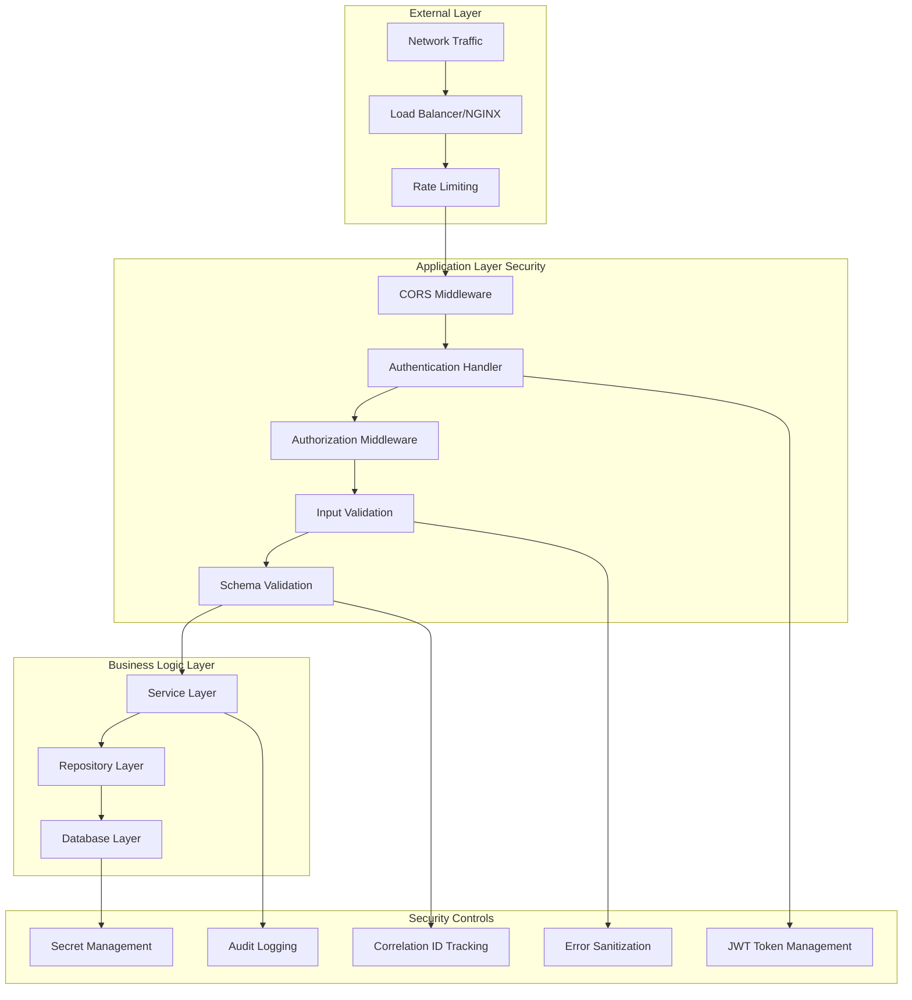

# Security & Compliance Guide

*Comprehensive security framework, authentication, authorization, and compliance requirements for RSF Utility*

---

## Table of Contents

1. [Security Overview](#security-overview)
2. [Authentication & Authorization](#authentication--authorization)
3. [Input Validation & Schema Enforcement](#input-validation--schema-enforcement)
4. [Secrets Management](#secrets-management)
5. [Threat Model](#threat-model)
6. [Security Controls](#security-controls)
7. [Compliance Framework](#compliance-framework)
8. [Supply Chain Security](#supply-chain-security)
9. [Security Monitoring](#security-monitoring)
10. [Incident Response](#incident-response)

---

## Security Overview

RSF Utility implements a comprehensive security framework designed for financial transaction processing in the ONDC ecosystem. The system follows security-by-design principles with multiple layers of protection.

### Security Architecture



### Security Principles

1. **Defense in Depth**: Multiple security layers with no single point of failure
2. **Least Privilege**: Minimal permissions for all components and users
3. **Zero Trust**: Verify every request regardless of source
4. **Secure by Default**: Safe configurations and behaviors as defaults
5. **Continuous Monitoring**: Real-time security event detection and response

---

## Authentication & Authorization

### JWT-Based Authentication

#### Token Structure & Configuration

```typescript
// JWT Authentication Configuration
interface AuthConfig {
  JWT_SECRET: string;        // HS256 signing key
  CLIENT_ID: string;         // Authorized client identifier
  tokenExpiration: string;   // Default: "7d"
  algorithm: "HS256";        // HMAC SHA-256
}

// Token Payload Structure
interface JWTPayload {
  client_id: string;         // Must match configured CLIENT_ID
  iat: number;              // Issued at timestamp
  exp: number;              // Expiration timestamp
}
```

#### Authentication Flow

```typescript
// Token Generation Endpoint
POST /ui/auth/sign-token
{
  "client_id": "authorized-client-id",
  "expires": "7d"          // Optional: "10s", "5m", "3d", etc.
}

// Response
{
  "success": true,
  "data": {
    "token": "eyJhbGciOiJIUzI1NiIsInR5cCI6IkpXVCJ9...",
    "expires_at": "2024-01-22T10:30:45.123Z"
  },
  "message": "Token issued successfully"
}
```

#### Authorization Middleware

```typescript
// Authentication Handler Implementation
const verifyClientToken = (req: Request, res: Response, next: NextFunction) => {
  try {
    const { JWT_SECRET, CLIENT_ID } = config;
    const authHeader = req.headers.authorization;
    
    if (!authHeader) {
      return sendError(res, "AUTH_INVALID_TOKEN", "Missing authorization token");
    }

    const token = authHeader.split(" ")[1]; // Bearer token format
    const decoded = jwt.verify(token, JWT_SECRET) as { client_id: string };

    if (decoded.client_id !== CLIENT_ID) {
      authLogger.error("Auth Token Verification Failed", {
        client_id: decoded.client_id
      });
      return sendError(res, "AUTH_INVALID_TOKEN", "Invalid client credentials");
    }

    next();
  } catch (err) {
    return sendError(res, "AUTH_INVALID_TOKEN", "Invalid or expired token");
  }
};
```

### API Route Protection

#### Public vs Protected Endpoints

```typescript
// Public Endpoints (No Authentication Required)
const publicRoutes = [
  "POST /ui/auth/sign-token",    // Token generation
  "GET /health",                 // Health checks
  "GET /metrics",                // Monitoring metrics
  "POST /api/*"                  // ONDC webhook endpoints
];

// Protected Endpoints (Authentication Required)
const protectedRoutes = [
  "GET /ui/users",               // User management
  "POST /ui/users",              // User creation
  "GET /ui/orders/*",            // Order management
  "POST /ui/generate/*",         // Settlement generation
  "POST /ui/trigger/*",          // Transaction triggering
  "PATCH /ui/settle/*",          // Settlement operations
  "GET /ui/recon/*",             // Reconciliation access
];
```

### Frontend Authentication

#### Token Management Strategy

```typescript
// Frontend Authentication Flow
interface AuthenticationFlow {
  tokenStorage: "localStorage";     // Persistent storage
  autoRefresh: boolean;             // Automatic token renewal
  refreshTrigger: "401_response";   // Trigger on authentication failure
  
  // Token Request Configuration
  tokenRequest: {
    endpoint: "/ui/auth/sign-token";
    clientId: process.env.REACT_APP_CLIENT_ID;
    defaultExpiry: "1d";
  };
  
  // Automatic Token Injection
  requestInterceptor: {
    header: "Authorization";
    format: "Bearer ${token}";
    excludePaths: ["/ui/auth/sign-token"];
  };
}
```

#### Axios Request Interceptors

```typescript
// Automatic Authentication Header Injection
instance.interceptors.request.use((config) => {
  const token = getStoredAuthToken();
  if (token && !isSignTokenRequest(config.url)) {
    config.headers = setAuthorizationHeader(config.headers, token);
  }
  return config;
});

// Automatic Token Refresh on 401
instance.interceptors.response.use(
  (response) => response,
  async (error: AxiosError) => {
    const status = error.response?.status;
    const originalRequest = error.config;

    if (status === 401 && originalRequest && !originalRequest._retry) {
      originalRequest._retry = true;
      
      try {
        const newToken = await requestNewToken();
        storeAuthToken(newToken);
        originalRequest.headers.Authorization = `Bearer ${newToken}`;
        return instance(originalRequest);
      } catch (refreshError) {
        clearStoredAuthToken();
        window.location.href = '/login';
        return Promise.reject(refreshError);
      }
    }
    
    return Promise.reject(error);
  }
);
```

### ONDC Network Authentication

#### Request Signing for External Services

```typescript
// ONDC Request Authentication
interface ONDCAuthConfig {
  subscriberId: string;             // Network participant ID
  subscriberUniqueId: string;       // Unique key identifier
  subscriberPrivateKey: string;     // Private key for signing
  
  // Request signing implementation
  createAuthorizationHeader: (payload: any) => Promise<string>;
  validateIncomingRequest: (headers: any, body: any) => Promise<boolean>;
}

// Header Creation for Outbound Requests
const createHeader = async (requirements: TriggeringRequirements) => {
  try {
    const header = await createAuthorizationHeader({
      body: JSON.stringify(requirements.data),
      privateKey: subscriberConfig.subscriberPrivateKey,
      subscriberId: subscriberConfig.subscriberId,
      subscriberUniqueKeyId: subscriberConfig.subscriberUniqueId,
    });
    
    headerLogger.info("Header created successfully", { header });
    return header;
  } catch (error) {
    headerLogger.error("Error creating header", {}, error);
    throw error;
  }
};
```

---

## Input Validation & Schema Enforcement

### Multi-Layer Validation Strategy

#### 1. HTTP Request Validation

```typescript
// Content-Type Enforcement
export function requireJsonContent(req: Request, res: Response, next: NextFunction) {
  if (req.headers["content-type"] !== "application/json") {
    return sendError(res, "INVALID_REQUEST_BODY", "Content-Type must be application/json");
  }
  next();
}

// Request Size Limits
const upload = multer({
  storage: multer.memoryStorage(),
  limits: { 
    fileSize: 10 * 1024 * 1024,    // 10MB per file
    fieldSize: 1024 * 1024,        // 1MB per field
    files: 5                       // Maximum 5 files
  },
  fileFilter: (req, file, cb) => {
    // Validate file types and extensions
    if (!file.originalname.endsWith(".json") || 
        file.mimetype !== "application/json") {
      return cb(new Error("Only JSON file uploads are allowed"));
    }
    cb(null, true);
  }
});
```

#### 2. Zod Schema Validation

```typescript
// Environment Variables Validation
export const envSchema = z.object({
  NODE_ENV: z.enum(["development", "production", "test"]).default("development"),
  SETTLEMENT_AGENCY_URL: z.url().describe("URL of the settlement agency"),
  SETTLEMENT_AGENCY_ID: z.string().describe("ID of the settlement agency"),
  SETTLEMENT_AGENCY_KEY: z.string().describe("API key for the settlement agency"),
  SUBSCRIBER_ID: z.string().describe("ID of the subscriber"),
  SUBSCRIBER_UNIQUE_ID: z.string().describe("Unique ID for the subscriber"),
  SUBSCRIBER_PRIVATE_KEY: z.string().describe("Private key for the subscriber"),
  JWT_SECRET: z.string().describe("JWT Secret Token for signing Client ID"),
  CLIENT_ID: z.string().describe("Client Id for the application"),
});

// User ID Validation
export const objectIdSchema = z
  .string()
  .length(24)
  .regex(/^[0-9a-fA-F]{24}$/, "Invalid user ID format")
  .openapi({
    description: "Unique identifier for the user config",
    example: "60c72b2f9b1e8b001c2f8b1e",
  });

// Currency Format Validation
const currencyObject = z.object({
  currency: z.string(),
  value: z.string().regex(/^\d+(?:\.\d{2})?$/, "Invalid currency format")
});
```

#### 3. ONDC Protocol Schema Validation

```typescript
// ONDC Context Validation
const contextSchema = z.object({
  domain: z.literal("ONDC:NTS10"),
  location: z.object({
    country: z.object({ code: z.string() }),
    city: z.object({ code: z.string() })
  }),
  version: z.literal("2.0.0"),
  action: z.string(),
  bap_id: z.string(),
  bap_uri: z.url(),
  bpp_id: z.string(),
  bpp_uri: z.url(),
  transaction_id: z.string(),
  message_id: z.string(),
  timestamp: z.string(),
  ttl: z.string()
});

// Settlement Schema Validation
const settlePayloadSchema = z.object({
  context: contextSchema,
  message: z.object({
    settlement: z.object({
      type: z.enum(Object.values(ENUMS.SETTLEMENT_TYPE) as [string, ...string[]]),
      orders: z.array(z.object({
        provider: z.object({
          bank_details: z.object({
            account_no: z.string().regex(/^\d+$/, "Account number must be digits only"),
            ifsc_code: z.string()
          })
        }).optional()
      })).optional()
    })
  })
}).strict();
```

#### 4. File Upload Security

```typescript
// File Validation Controller
export const schemaValidator = (req: Request, res: Response, next: NextFunction) => {
  try {
    const payloads = (req as any).processedJsonPayloads || undefined;
    
    if (!payloads) {
      return sendError(res, "VALIDATION_FAILED", "No payloads to validate");
    }

    const validated: any[] = [];
    const errors: any[] = [];

    payloads.forEach((payload: any, index: number) => {
      const filename = `file_${index}.json`;
      
      try {
        const { valid, schemaErrors } = validateSchemaForAction(
          payload, 
          req.params.action, 
          getLoggerMeta(req)
        );
        
        if (!valid) {
          errors.push({ filename, error: schemaErrors });
        } else {
          validated.push(payload);
        }
      } catch (error) {
        errors.push({
          filename,
          error: error instanceof Error ? error.message : "Unknown error"
        });
      }
    });

    if (errors.length) {
      return sendError(res, "SCHEMA_VALIDATION_FAILED", "Schema validation failed", {
        errors
      });
    }

    (req as any).validatedPayloads = validated;
    delete (req as any).processedJsonPayloads; // Clean up to prevent memory leaks
    next();
  } catch (error) {
    return sendError(res, "VALIDATION_ERROR", "Validation process failed");
  }
};
```

### Idempotency Implementation

#### Transaction ID Tracking

```typescript
// Idempotency Middleware
interface IdempotencyConfig {
  keyGeneration: "transaction_id" | "message_id" | "custom";
  storage: "memory" | "redis" | "database";
  ttl: number; // Time to live in seconds
}

// Request Deduplication
const idempotencyMiddleware = (req: Request, res: Response, next: NextFunction) => {
  const idempotencyKey = req.headers['idempotency-key'] || 
                        req.body?.context?.transaction_id ||
                        req.body?.context?.message_id;
  
  if (!idempotencyKey) {
    return sendError(res, "MISSING_IDEMPOTENCY_KEY", "Idempotency key required");
  }

  // Check for duplicate requests
  const existingRequest = getStoredRequest(idempotencyKey);
  if (existingRequest) {
    if (existingRequest.status === 'completed') {
      return res.status(existingRequest.statusCode).json(existingRequest.response);
    } else {
      return sendError(res, "REQUEST_IN_PROGRESS", "Request already being processed");
    }
  }

  // Store request for tracking
  storeRequest(idempotencyKey, { status: 'processing', timestamp: Date.now() });
  
  req.idempotencyKey = idempotencyKey;
  next();
};
```

#### Duplicate Prevention Strategies

```typescript
// Database-Level Duplicate Prevention
const upsertSettlement = async (settlementData: SettlementData) => {
  const filter = {
    user_id: settlementData.user_id,
    order_id: settlementData.order_id,
    settlement_id: settlementData.settlement_id
  };
  
  const update = {
    $set: settlementData,
    $setOnInsert: { createdAt: new Date() }
  };
  
  const options = { 
    upsert: true, 
    new: true,
    runValidators: true 
  };
  
  return await Settlement.findOneAndUpdate(filter, update, options);
};

// Order Update with Timestamp Validation
const updateOrderWithTimestampCheck = async (userId: string, orderId: string, newData: any) => {
  const existingOrder = await Order.findOne({ user_id: userId, order_id: orderId });
  
  if (existingOrder) {
    const existingUpdatedAt = existingOrder.updated_at;
    const newUpdatedAt = new Date(newData.updated_at);
    
    if (newUpdatedAt > existingUpdatedAt) {
      return await Order.findOneAndUpdate(
        { user_id: userId, order_id: orderId },
        { $set: newData },
        { new: true, runValidators: true }
      );
    } else {
      logger.info("Skipping update: existing order is newer", {
        userId, orderId, existingUpdatedAt, newUpdatedAt
      });
      return existingOrder;
    }
  } else {
    return await Order.create({ ...newData, user_id: userId });
  }
};
```

---

## Secrets Management

### Environment-Based Configuration

#### Development vs Production Separation

```typescript
// Development Environment (.env.development)
interface DevelopmentSecrets {
  JWT_SECRET: "test-token-secret";                    // Non-production secret
  CLIENT_ID: "test-client";                          // Test client identifier
  MONGODB_URI: "mongodb://localhost:27017/rsf-dev"; // Local database
  LOG_LEVEL: "debug";                               // Verbose logging
  NODE_ENV: "development";
}

// Production Environment (.env.production)
interface ProductionSecrets {
  JWT_SECRET: string;                               // Strong random secret (256-bit)
  CLIENT_ID: string;                               // Production client ID
  MONGODB_URI: string;                             // Production database URI
  SETTLEMENT_AGENCY_URL: string;                   // Live settlement agency
  SETTLEMENT_AGENCY_KEY: string;                   // API key for settlement agency
  SUBSCRIBER_PRIVATE_KEY: string;                  // ONDC signing key
  LOKI_HOST: string;                              // Production logging endpoint
  LOG_LEVEL: "info" | "warn" | "error";           // Production log levels
}
```

#### Secret Validation & Startup Checks

```typescript
// Environment Validation on Startup
export function validateEnv(config: Record<string, unknown>) {
  const result = envSchema.safeParse(config);

  if (!result.success) {
    const errorMessage = z.treeifyError(result.error);
    logger.error("❌ Invalid environment variables:", {
      errorMessage: errorMessage,
    });
    throw new Error("Failed to parse environment variables. See the log above for details.");
  }
  
  logger.info("✅ Environment variables validated successfully.");
}

// Startup Security Checks
const performSecurityChecks = () => {
  // JWT Secret Strength Validation
  if (process.env.NODE_ENV === 'production') {
    const jwtSecret = process.env.JWT_SECRET;
    if (!jwtSecret || jwtSecret.length < 32) {
      throw new Error("JWT_SECRET must be at least 32 characters in production");
    }
  }
  
  // Required Secrets Validation
  const requiredSecrets = [
    'SETTLEMENT_AGENCY_URL',
    'SETTLEMENT_AGENCY_KEY', 
    'SUBSCRIBER_PRIVATE_KEY'
  ];
  
  const missingSecrets = requiredSecrets.filter(secret => !process.env[secret]);
  if (missingSecrets.length > 0) {
    throw new Error(`Missing required secrets: ${missingSecrets.join(', ')}`);
  }
};
```

### Secret Storage Recommendations

#### Container Environment Strategy

```yaml
# Docker Compose Secret Management
version: '3.8'
services:
  rsf_backend:
    image: rsf-utility:latest
    environment:
      - NODE_ENV=production
      - LOG_LEVEL=info
    secrets:
      - jwt_secret
      - settlement_agency_key
      - subscriber_private_key
      - mongodb_uri
    
secrets:
  jwt_secret:
    external: true
    name: rsf_jwt_secret_v1
  settlement_agency_key:
    external: true
    name: rsf_settlement_key_v1
  subscriber_private_key:
    external: true  
    name: rsf_subscriber_key_v1
  mongodb_uri:
    external: true
    name: rsf_mongodb_uri_v1
```

#### Kubernetes Secret Management

```yaml
# Kubernetes Secret Configuration
apiVersion: v1
kind: Secret
metadata:
  name: rsf-utility-secrets
  namespace: production
type: Opaque
data:
  jwt-secret: <base64-encoded-secret>
  settlement-agency-key: <base64-encoded-key>
  subscriber-private-key: <base64-encoded-private-key>
  mongodb-uri: <base64-encoded-connection-string>

---
apiVersion: apps/v1
kind: Deployment
metadata:
  name: rsf-backend
spec:
  template:
    spec:
      containers:
      - name: rsf-backend
        image: rsf-utility:latest
        env:
        - name: JWT_SECRET
          valueFrom:
            secretKeyRef:
              name: rsf-utility-secrets
              key: jwt-secret
        - name: SETTLEMENT_AGENCY_KEY
          valueFrom:
            secretKeyRef:
              name: rsf-utility-secrets
              key: settlement-agency-key
```

### Secret Rotation Strategy

#### Automated Key Rotation

```typescript
// JWT Secret Rotation Support
interface SecretRotationConfig {
  currentSecret: string;
  previousSecret?: string;
  rotationSchedule: "monthly" | "quarterly";
  gracePeriod: number; // Hours to accept both old and new secrets
}

// Multi-Secret JWT Verification
const verifyTokenWithRotation = (token: string, secrets: string[]) => {
  for (const secret of secrets) {
    try {
      const decoded = jwt.verify(token, secret);
      return { decoded, secretUsed: secret };
    } catch (error) {
      continue; // Try next secret
    }
  }
  throw new Error("Token verification failed with all available secrets");
};
```

---

## Threat Model

### Threat Categories & Mitigations

#### 1. Authentication & Authorization Threats

| Threat | Impact | Likelihood | Mitigation |
|--------|---------|------------|------------|
| JWT Token Theft | High | Medium | Short expiration, secure storage, HTTPS only |
| Brute Force Attacks | Medium | High | Rate limiting, account lockout, strong secrets |
| Session Hijacking | High | Low | Correlation IDs, IP validation, secure headers |
| Privilege Escalation | High | Low | Role-based access, least privilege principle |

#### 2. Input Validation Threats

| Threat | Impact | Likelihood | Mitigation |
|--------|---------|------------|------------|
| SQL Injection | High | Low | MongoDB (NoSQL), parameterized queries |
| XSS Attacks | Medium | Medium | Input sanitization, output encoding |
| Path Traversal | High | Low | File upload restrictions, path validation |
| Buffer Overflow | High | Low | Input length limits, schema validation |

#### 3. Business Logic Threats

| Threat | Impact | Likelihood | Mitigation |
|--------|---------|------------|------------|
| Double Spending | Critical | Medium | Idempotency keys, transaction validation |
| Amount Manipulation | Critical | Low | Cryptographic signing, validation checks |
| Settlement Fraud | Critical | Low | Multi-party verification, audit trails |
| Data Integrity | High | Low | Checksums, digital signatures |

#### 4. Infrastructure Threats

| Threat | Impact | Likelihood | Mitigation |
|--------|---------|------------|------------|
| DDoS Attacks | High | Medium | Rate limiting, load balancing, CDN |
| Man-in-the-Middle | High | Low | HTTPS/TLS, certificate pinning |
| Data Breach | Critical | Low | Encryption at rest, access controls |
| Service Disruption | High | Medium | Health monitoring, auto-scaling |

### Attack Vector Analysis

#### Network-Level Attacks

```typescript
// DDoS Protection Configuration
const rateLimiter = rateLimit({
  windowMs: 1 * 60 * 1000,           // 1 minute window
  limit: operationConfig.rateLimit,   // Configurable request limit
  standardHeaders: "draft-8",         // Standard rate limit headers
  legacyHeaders: false,
  keyGenerator: () => "global",       // Global rate limiting
  
  handler: (req, res) => {
    rateLimitLogger.warning("Rate limit exceeded", {
      ip: req.ip,
      userAgent: req.get('User-Agent'),
      path: req.path
    });
    
    return sendError(res, "RATE_LIMIT_EXCEEDED", "Too many requests");
  }
});

// CORS Security Configuration
const corsOptions = {
  origin: (origin: string, callback: Function) => {
    const allowedOrigins = process.env.ALLOWED_ORIGINS?.split(',') || [];
    
    if (!origin || allowedOrigins.includes(origin)) {
      callback(null, true);
    } else {
      callback(new Error('Not allowed by CORS'));
    }
  },
  credentials: true,
  optionsSuccessStatus: 200
};
```

#### Application-Level Attacks

```typescript
// SQL Injection Prevention (MongoDB Context)
const preventNoSQLInjection = (query: any) => {
  // Prevent $where injection
  const sanitizeObject = (obj: any): any => {
    if (typeof obj === 'string') {
      return obj.replace(/\$where/gi, '').replace(/\$regex/gi, '');
    }
    
    if (Array.isArray(obj)) {
      return obj.map(sanitizeObject);
    }
    
    if (obj && typeof obj === 'object') {
      const sanitized: any = {};
      for (const [key, value] of Object.entries(obj)) {
        if (!key.startsWith('$')) {  // Block operator injection
          sanitized[key] = sanitizeObject(value);
        }
      }
      return sanitized;
    }
    
    return obj;
  };
  
  return sanitizeObject(query);
};

// XSS Prevention
const sanitizeInput = (input: string): string => {
  return input
    .replace(/<script\b[^<]*(?:(?!<\/script>)<[^<]*)*<\/script>/gi, '')
    .replace(/javascript:/gi, '')
    .replace(/on\w+\s*=/gi, '')
    .trim();
};
```

#### Business Logic Attack Prevention

```typescript
// Double-Spending Prevention
interface TransactionGuard {
  checkDuplicate: (transactionId: string) => Promise<boolean>;
  validateAmount: (amount: number) => boolean;
  verifySignature: (payload: any, signature: string) => Promise<boolean>;
  enforceBusinessRules: (transaction: any) => Promise<ValidationResult>;
}

const preventDoubleSpending = async (settlementRequest: any) => {
  const transactionId = settlementRequest.context.transaction_id;
  
  // Check for duplicate transaction ID
  const existingTransaction = await Transaction.findOne({ 
    transaction_id: transactionId 
  });
  
  if (existingTransaction) {
    if (existingTransaction.status === 'completed') {
      throw new Error('Transaction already processed');
    } else if (existingTransaction.status === 'processing') {
      throw new Error('Transaction currently being processed');
    }
  }
  
  // Create transaction record to prevent duplicates
  await Transaction.create({
    transaction_id: transactionId,
    status: 'processing',
    createdAt: new Date()
  });
  
  return true;
};
```

---

## Security Controls

### Runtime Security Measures

#### Request/Response Security

```typescript
// Security Headers Middleware
const securityHeadersMiddleware = (req: Request, res: Response, next: NextFunction) => {
  // Prevent clickjacking
  res.setHeader('X-Frame-Options', 'DENY');
  
  // Prevent MIME type sniffing
  res.setHeader('X-Content-Type-Options', 'nosniff');
  
  // XSS Protection
  res.setHeader('X-XSS-Protection', '1; mode=block');
  
  // Strict Transport Security (if HTTPS)
  if (req.secure) {
    res.setHeader('Strict-Transport-Security', 'max-age=31536000; includeSubDomains');
  }
  
  // Content Security Policy
  res.setHeader('Content-Security-Policy', "default-src 'self'; script-src 'self'");
  
  // Referrer Policy
  res.setHeader('Referrer-Policy', 'strict-origin-when-cross-origin');
  
  next();
};

// Request Correlation and Tracking
const correlationIdMiddleware = (req: Request, res: Response, next: NextFunction) => {
  const correlationId = req.headers['x-correlation-id'] as string || 
                       `req_${Date.now()}_${Math.random().toString(36).substr(2, 9)}`;
  
  req.correlationId = correlationId;
  res.setHeader('x-correlation-id', correlationId);
  
  // Attach logger with correlation ID
  req.logger = new AutomationLogger(correlationId);
  
  next();
};
```

#### Error Handling Security

```typescript
// Secure Error Response Handler
const secureErrorHandler = (err: Error, req: Request, res: Response, next: NextFunction) => {
  // Log detailed error for internal use
  logger.error('Internal Server Error', {
    error: err.message,
    stack: err.stack,
    correlationId: req.correlationId,
    path: req.path,
    method: req.method
  });
  
  // Return sanitized error to client
  const isDevelopment = process.env.NODE_ENV === 'development';
  
  const publicError = {
    success: false,
    error: {
      code: 'INTERNAL_ERROR',
      message: isDevelopment ? err.message : 'An internal error occurred',
      correlationId: req.correlationId
    }
  };
  
  // Never expose sensitive information
  if (isDevelopment) {
    delete publicError.error.stack;
  }
  
  res.status(500).json(publicError);
};

// Information Disclosure Prevention
const sanitizeErrorMessage = (error: string): string => {
  // Remove sensitive patterns
  const sensitivePatterns = [
    /password[=:]\s*\S+/gi,
    /secret[=:]\s*\S+/gi,
    /key[=:]\s*\S+/gi,
    /token[=:]\s*\S+/gi,
    /mongodb:\/\/[^\/]+/gi,
    /database[=:]\s*\S+/gi
  ];
  
  let sanitized = error;
  sensitivePatterns.forEach(pattern => {
    sanitized = sanitized.replace(pattern, '[REDACTED]');
  });
  
  return sanitized;
};
```

### Audit & Compliance Controls

#### Comprehensive Audit Logging

```typescript
// Audit Event Types
enum AuditEventType {
  USER_AUTHENTICATION = 'user_authentication',
  DATA_ACCESS = 'data_access',
  DATA_MODIFICATION = 'data_modification',
  SETTLEMENT_OPERATION = 'settlement_operation',
  SYSTEM_CONFIGURATION = 'system_configuration',
  SECURITY_EVENT = 'security_event'
}

// Audit Log Structure
interface AuditLog {
  timestamp: string;
  eventType: AuditEventType;
  userId?: string;
  correlationId: string;
  ipAddress: string;
  userAgent: string;
  action: string;
  resource: string;
  outcome: 'success' | 'failure';
  details: Record<string, any>;
  securityContext: {
    authMethod: string;
    tokenUsed: boolean;
    riskScore?: number;
  };
}

// Audit Logger Implementation
class AuditLogger {
  static async logEvent(event: AuditLog): Promise<void> {
    // Store in database for compliance
    await AuditLogModel.create(event);
    
    // Send to SIEM if configured
    if (process.env.SIEM_ENDPOINT) {
      await this.sendToSIEM(event);
    }
    
    // Log to structured logging system
    logger.info('Audit Event', event);
  }
  
  static async logSecurityEvent(
    eventType: string,
    details: Record<string, any>,
    request: Request
  ): Promise<void> {
    const auditEvent: AuditLog = {
      timestamp: new Date().toISOString(),
      eventType: AuditEventType.SECURITY_EVENT,
      correlationId: request.correlationId || 'unknown',
      ipAddress: request.ip || 'unknown',
      userAgent: request.get('User-Agent') || 'unknown',
      action: eventType,
      resource: request.path,
      outcome: 'failure', // Security events are typically failures
      details,
      securityContext: {
        authMethod: request.headers.authorization ? 'jwt' : 'none',
        tokenUsed: !!request.headers.authorization
      }
    };
    
    await this.logEvent(auditEvent);
  }
}
```

#### Financial Transaction Auditing

```typescript
// Settlement Audit Trail
const auditSettlementOperation = async (
  operation: string,
  settlementData: any,
  request: Request,
  result: any
) => {
  const auditEvent: AuditLog = {
    timestamp: new Date().toISOString(),
    eventType: AuditEventType.SETTLEMENT_OPERATION,
    userId: settlementData.user_id,
    correlationId: request.correlationId,
    ipAddress: request.ip,
    userAgent: request.get('User-Agent'),
    action: operation,
    resource: 'settlement',
    outcome: result.success ? 'success' : 'failure',
    details: {
      settlementId: settlementData.settlement_id,
      orderId: settlementData.order_id,
      amount: settlementData.amount,
      transactionId: settlementData.transaction_id,
      agencyResponse: result.agencyResponse
    },
    securityContext: {
      authMethod: 'jwt',
      tokenUsed: true
    }
  };
  
  await AuditLogger.logEvent(auditEvent);
};

// Data Access Auditing
const auditDataAccess = async (
  resource: string,
  action: string,
  request: Request,
  dataAccessed: any
) => {
  const auditEvent: AuditLog = {
    timestamp: new Date().toISOString(),
    eventType: AuditEventType.DATA_ACCESS,
    correlationId: request.correlationId,
    ipAddress: request.ip,
    userAgent: request.get('User-Agent'),
    action,
    resource,
    outcome: 'success',
    details: {
      recordCount: Array.isArray(dataAccessed) ? dataAccessed.length : 1,
      queryParameters: request.query,
      pathParameters: request.params
    },
    securityContext: {
      authMethod: 'jwt',
      tokenUsed: true
    }
  };
  
  await AuditLogger.logEvent(auditEvent);
};
```

---

## Supply Chain Security

### Dependency Management

#### Package Security Monitoring

```json
{
  "dependencies": {
    "@asteasolutions/zod-to-openapi": "^8.1.0",
    "axios": "^1.11.0",
    "express": "^5.1.0",
    "jsonwebtoken": "^9.0.2",
    "mongoose": "^8.17.0",
    "winston": "^3.17.0",
    "zod": "^4.0.14"
  },
  "devDependencies": {
    "@types/node": "^22.15.0",
    "jest": "^30.0.0",
    "typescript": "^5.7.2"
  },
  "scripts": {
    "audit": "npm audit --audit-level moderate",
    "audit-fix": "npm audit fix",
    "security-scan": "npm audit && snyk test"
  }
}
```

#### Automated Security Scanning

```yaml
# GitHub Actions Security Workflow
name: Security Scan
on: [push, pull_request]

jobs:
  security-scan:
    runs-on: ubuntu-latest
    steps:
      - uses: actions/checkout@v3
      
      - name: Setup Node.js
        uses: actions/setup-node@v3
        with:
          node-version: '18'
          
      - name: Install dependencies
        run: npm ci
        
      - name: Run npm audit
        run: npm audit --audit-level moderate
        
      - name: Run Snyk security scan
        uses: snyk/actions/node@master
        env:
          SNYK_TOKEN: ${{ secrets.SNYK_TOKEN }}
          
      - name: Run Semgrep security scan
        uses: returntocorp/semgrep-action@v1
        with:
          config: >-
            p/security-audit
            p/secrets
            p/owasp-top-ten
```

### Software Bill of Materials (SBOM)

#### SBOM Generation

```bash
#!/bin/bash
# SBOM Generation Script

# Generate SBOM using cyclonedx
npx @cyclonedx/cyclonedx-npm --output-file sbom.json

# Generate SBOM using syft
syft packages dir:. -o json > sbom-syft.json

# Generate license report
npx license-checker --json > licenses.json

# Generate vulnerability report
npm audit --json > vulnerability-report.json

# Create comprehensive SBOM package
tar -czf rsf-utility-sbom.tar.gz sbom.json sbom-syft.json licenses.json vulnerability-report.json
```

#### SBOM Structure

```json
{
  "bomFormat": "CycloneDX",
  "specVersion": "1.4",
  "serialNumber": "urn:uuid:rsf-utility-${version}",
  "version": 1,
  "metadata": {
    "timestamp": "2024-01-15T10:30:45.123Z",
    "component": {
      "type": "application",
      "name": "rsf-utility",
      "version": "1.0.0"
    }
  },
  "components": [
    {
      "type": "library",
      "name": "express",
      "version": "5.1.0",
      "purl": "pkg:npm/express@5.1.0",
      "licenses": [
        {
          "license": {
            "id": "MIT"
          }
        }
      ],
      "hashes": [
        {
          "alg": "SHA-256",
          "content": "abc123..."
        }
      ]
    }
  ],
  "vulnerabilities": [
    {
      "id": "CVE-2024-XXXX",
      "source": {
        "name": "NPM Audit"
      },
      "affects": [
        {
          "ref": "pkg:npm/express@5.1.0"
        }
      ],
      "severity": "medium"
    }
  ]
}
```

### Container Security

#### Docker Security Best Practices

```dockerfile
# Multi-stage build for security
FROM node:18-alpine AS builder

# Create non-root user
RUN addgroup -g 1001 -S nodejs
RUN adduser -S nextjs -u 1001

# Set working directory
WORKDIR /app

# Copy package files
COPY package*.json ./

# Install dependencies
RUN npm ci --only=production && npm cache clean --force

# Copy source code
COPY . .

# Build application
RUN npm run build

# Production stage
FROM node:18-alpine AS runner

# Install security updates
RUN apk update && apk upgrade

# Create app directory
WORKDIR /app

# Create non-root user
RUN addgroup -g 1001 -S nodejs
RUN adduser -S appuser -u 1001

# Copy built application
COPY --from=builder --chown=appuser:nodejs /app/dist ./dist
COPY --from=builder --chown=appuser:nodejs /app/node_modules ./node_modules
COPY --from=builder --chown=appuser:nodejs /app/package.json ./package.json

# Switch to non-root user
USER appuser

# Expose port
EXPOSE 3000

# Health check
HEALTHCHECK --interval=30s --timeout=3s --start-period=5s --retries=3 \
  CMD curl -f http://localhost:3000/health || exit 1

# Start application
CMD ["node", "dist/index.js"]
```

---

## Security Monitoring

### Real-time Security Monitoring

#### Security Event Detection

```typescript
// Security Event Monitor
class SecurityEventMonitor {
  private static readonly suspiciousPatterns = [
    /\b(?:union|select|insert|update|delete|drop|create|alter)\b/i,
    /<script[^>]*>.*?<\/script>/gi,
    /javascript:/gi,
    /\.\.\//g,
    /\%2e\%2e\%2f/gi
  ];
  
  static detectSuspiciousActivity(request: Request): SecurityAlert[] {
    const alerts: SecurityAlert[] = [];
    const requestData = JSON.stringify({
      body: request.body,
      query: request.query,
      params: request.params
    });
    
    // Pattern-based detection
    this.suspiciousPatterns.forEach((pattern, index) => {
      if (pattern.test(requestData)) {
        alerts.push({
          type: 'pattern_match',
          severity: 'medium',
          pattern: pattern.toString(),
          source: 'request_data',
          timestamp: new Date(),
          correlationId: request.correlationId
        });
      }
    });
    
    // Rate limit violation detection
    const clientIP = request.ip;
    const requestCount = this.getRequestCount(clientIP);
    if (requestCount > 100) { // Per minute threshold
      alerts.push({
        type: 'rate_limit_violation',
        severity: 'high',
        source: 'rate_limiter',
        details: { ip: clientIP, count: requestCount },
        timestamp: new Date(),
        correlationId: request.correlationId
      });
    }
    
    return alerts;
  }
  
  static async handleSecurityAlert(alert: SecurityAlert, request: Request) {
    // Log security event
    await AuditLogger.logSecurityEvent(alert.type, alert, request);
    
    // Real-time notification for high severity
    if (alert.severity === 'high' || alert.severity === 'critical') {
      await this.sendSecurityNotification(alert);
    }
    
    // Update threat intelligence
    await this.updateThreatIntelligence(alert);
  }
  
  private static async sendSecurityNotification(alert: SecurityAlert) {
    const notification = {
      type: 'security_alert',
      severity: alert.severity,
      message: `Security alert: ${alert.type}`,
      details: alert,
      timestamp: new Date()
    };
    
    // Send to monitoring dashboard
    await fetch(process.env.SECURITY_WEBHOOK_URL, {
      method: 'POST',
      headers: { 'Content-Type': 'application/json' },
      body: JSON.stringify(notification)
    });
  }
}
```

#### Security Metrics Collection

```typescript
// Security Metrics for Prometheus
import promClient from 'prom-client';

const securityMetrics = {
  // Authentication metrics
  authenticationAttempts: new promClient.Counter({
    name: 'authentication_attempts_total',
    help: 'Total number of authentication attempts',
    labelNames: ['result', 'client_type']
  }),
  
  // Security events
  securityEvents: new promClient.Counter({
    name: 'security_events_total',
    help: 'Total number of security events detected',
    labelNames: ['event_type', 'severity']
  }),
  
  // Failed requests
  failedRequests: new promClient.Counter({
    name: 'failed_requests_total',
    help: 'Total number of failed requests',
    labelNames: ['error_type', 'endpoint']
  }),
  
  // Response times
  responseTime: new promClient.Histogram({
    name: 'request_duration_seconds',
    help: 'Request duration in seconds',
    labelNames: ['method', 'route', 'status_code'],
    buckets: [0.1, 0.5, 1, 2, 5]
  })
};

// Metrics collection middleware
const collectSecurityMetrics = (req: Request, res: Response, next: NextFunction) => {
  const start = Date.now();
  
  res.on('finish', () => {
    const duration = (Date.now() - start) / 1000;
    const route = req.route?.path || req.path;
    
    // Collect response time metrics
    securityMetrics.responseTime.observe(
      { method: req.method, route, status_code: res.statusCode },
      duration
    );
    
    // Collect failed request metrics
    if (res.statusCode >= 400) {
      const errorType = res.statusCode >= 500 ? 'server_error' : 'client_error';
      securityMetrics.failedRequests.inc({ error_type: errorType, endpoint: route });
    }
    
    // Collect authentication metrics
    if (req.path.includes('/auth/')) {
      const result = res.statusCode === 200 ? 'success' : 'failure';
      securityMetrics.authenticationAttempts.inc({ result, client_type: 'api' });
    }
  });
  
  next();
};
```

### Security Dashboard Configuration

#### Grafana Security Dashboard

```json
{
  "dashboard": {
    "title": "RSF Utility - Security Monitoring",
    "panels": [
      {
        "title": "Authentication Success Rate",
        "type": "stat",
        "targets": [
          {
            "expr": "rate(authentication_attempts_total{result=\"success\"}[5m]) / rate(authentication_attempts_total[5m]) * 100",
            "legendFormat": "Success Rate %"
          }
        ]
      },
      {
        "title": "Security Events by Type",
        "type": "graph",
        "targets": [
          {
            "expr": "rate(security_events_total[5m])",
            "legendFormat": "{{event_type}} - {{severity}}"
          }
        ]
      },
      {
        "title": "Failed Requests",
        "type": "graph",
        "targets": [
          {
            "expr": "rate(failed_requests_total[5m])",
            "legendFormat": "{{error_type}} - {{endpoint}}"
          }
        ]
      },
      {
        "title": "Response Time Percentiles",
        "type": "graph",
        "targets": [
          {
            "expr": "histogram_quantile(0.95, rate(request_duration_seconds_bucket[5m]))",
            "legendFormat": "95th Percentile"
          },
          {
            "expr": "histogram_quantile(0.50, rate(request_duration_seconds_bucket[5m]))",
            "legendFormat": "Median"
          }
        ]
      }
    ]
  }
}
```

---
