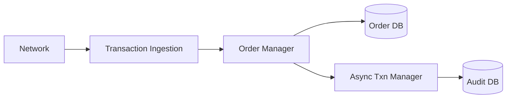
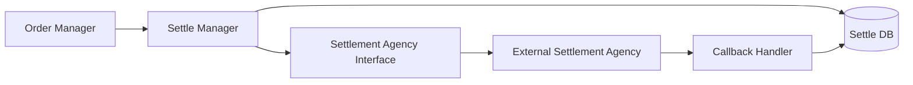
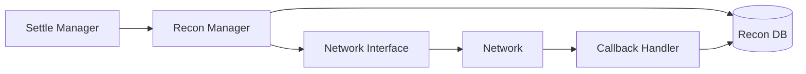

# System Architecture

This document provides a detailed overview of the RSF Utility system architecture.

## Table of Contents
- [System Overview](#system-overview)
- [Architecture Components](#architecture-components)
- [Data Flow](#data-flow)
- [External Interfaces](#external-interfaces)
- [Database Design](#database-design)
- [Security](#security)
- [Observability](#observability)

## System Overview

RSF Utility is built as a modular transaction processing system with the following key capabilities:

1. Transaction payload ingestion and processing
2. Settlement management with external agencies
3. Reconciliation with network
4. Administrative UI
5. Data persistence and audit
6. System monitoring and observability

## Architecture Components

### 1. Frontend Layer
- **RSF Utility UI (React)**
  - Single-page application
  - JWT authentication
  - HTTPS communication
  - Dynamic configuration

### 2. Backend Layer (Node.js, TypeScript)
- **API Endpoints**
  - Transaction endpoints (`/on_confirm`, `/on_status`, `/on_update`, `/on_cancel`)
  - Settlement endpoints (`/settle`, `/on_settle`)
  - Reconciliation endpoints (`/recon`, `/on_recon`)
  - UI/Admin endpoints

### 3. Core Modules

#### Transaction Payload Ingestion Module
- Validates incoming payloads
- Schema validation
- Forwards to Order Manager

#### Order Manager Module
- Creates order records
- Manages state transitions
- Persists to Order DB

#### Settle Manager Module
- Composes settlement requests
- Persists to Settle DB
- Interacts with Settlement Agency

#### Recon Manager Module
- Manages reconciliation logic
- Persists to Recon DB
- Network interaction handling

#### Async Transaction Manager
- Background task processing
- Event handling
- Audit logging

### 4. Interfaces

#### Settlement Agency Interface
- External settlement agency communication
- Settlement request handling
- Callback processing

#### Network Interface
- Network endpoint communication
- Reconciliation request handling
- Response processing

## Data Flow

### 1. Transaction Flow


### 2. Settlement Flow


### 3. Reconciliation Flow


## External Interfaces

### 1. Network Interfaces
- **Incoming Transaction Endpoints**
  - Schema validation
  - Payload processing
  - State management

- **Reconciliation Endpoints**
  - Network communication
  - Status tracking
  - Error handling

### 2. Settlement Agency Interface
- **Settlement Operations**
  - Request composition
  - Response handling
  - Status tracking

### 3. Administrative Interface
- **UI Endpoints**
  - Configuration management
  - Status monitoring
  - User management

## Database Design

### 1. Logical Database Structure
```
MongoDB
├── Order DB
│   ├── Orders
│   └── Transactions
├── Settle DB
│   ├── Settlements
│   └── Settlement_Status
├── Recon DB
│   ├── Reconciliations
│   └── Discrepancies
├── Config DB
│   ├── System_Config
│   └── User_Config
└── Audit DB
    ├── Operation_Logs
    └── System_Events
```

### 2. Key Collections

#### Orders Collection
```typescript
interface Order {
    order_id: string;
    user_id: string;
    state: OrderState;
    created_at: Date;
    updated_at: Date;
    // ... other fields
}
```

#### Settlements Collection
```typescript
interface Settlement {
    settlement_id: string;
    order_id: string;
    status: SettlementStatus;
    amount: number;
    // ... other fields
}
```

#### Reconciliation Collection
```typescript
interface Reconciliation {
    recon_id: string;
    settlement_id: string;
    status: ReconStatus;
    // ... other fields
}
```

## Security

### 1. Authentication
- JWT-based authentication
- Role-based access control
- Token management

### 2. Communication Security
- HTTPS encryption
- API key authentication
- Request signing

### 3. Data Security
- Encrypted sensitive data
- Access logging
- Audit trails

## Observability

### 1. Logging
- Structured JSON logs
- Log levels and categorization
- Centralized logging (Loki)

### 2. Monitoring
- Grafana dashboards
- Performance metrics
- Error tracking

### 3. Metrics
- Transaction throughput
- Error rates
- Response times
- System health

### 4. Alerting
- Error rate thresholds
- System health alerts
- Performance degradation alerts

## Infrastructure

### 1. Deployment
- Docker containerization
- Network participant hosting
- Scalable architecture

### 2. Storage
- MongoDB for persistent data
- Replica sets for high availability
- Backup mechanisms

### 3. Observability Stack
- Loki for log aggregation
- Grafana for visualization
- Prometheus for metrics

For more detailed information about specific components, please refer to the respective documentation in the `docs/` directory.
