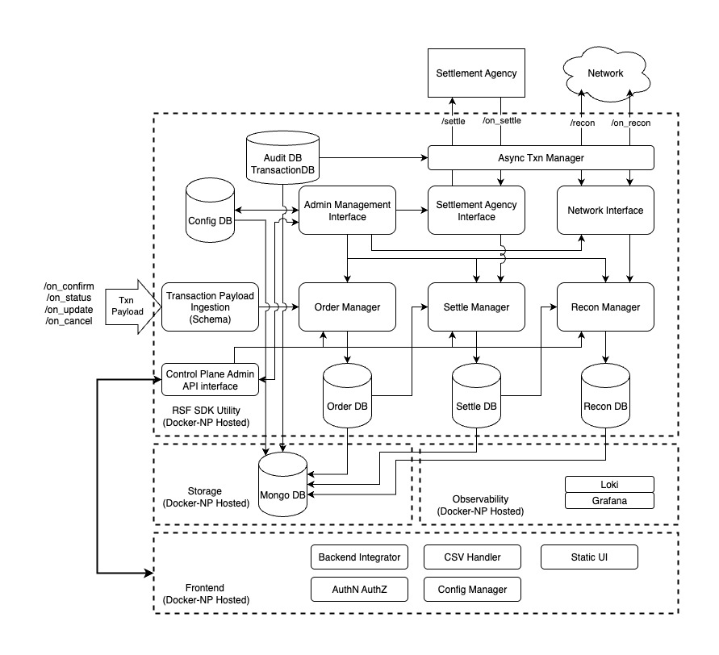

# RSF Utility High Level Design (HLD)
## **1. High level System Architecture**

  

  

**components:**

  

  

*  **RSF Utility UI (React)**

  

* A single-page app for operators to view orders, settlements, recon results, and system config. It authenticates with the backend via JWT and communicates over HTTPS. Reads dynamic configuration from `Config DB`.

  

*  **Backend (Node.js, TypeScript)**

  

* Exposes REST endpoints (ingestion endpoints: `/on_confirm`, `/on_status`, `/on_update`, `/on_cancel`; settlement endpoints: `/settle`, `/on_settle`; recon `/recon`, `/on_recon`; plus UI endpoints).

  

* Contains modules: Transaction Payload Ingestion, Order Manager, Settle Manager, Recon Manager, Async Txn Manager, Network Interface, Settlement Agency Interface.

  

*  **Transaction Payload Ingestion Module**

  

* Validates incoming payloads against a schema and forwards valid payloads to the Order Manager. This is the front-line for network-originating messages.

  

*  **Order Manager Module**

  

* Handles creation and state transitions of order records. Persists to **Order DB** 

  

*  **Settle Manager Module** & **Settlement Agency Interface**

  

* The Settle Manager composes settlement requests, persists them to **Settle DB** , and uses the Settlement Agency Interface (SAI) to call the external Settlement Agency (via `/settle`) and handle callbacks (`/on_settle`).

  

*  **Recon Manager Module** & **Network Interface**

  

* Recon Manager manages reconciliation logic, persists records to **Recon DB** , and uses Network Interface to call external network endpoints (`/recon`) and receive callbacks (`/on_recon`).

  

*  **Async Txn Manager Module** & **Audit DB**

  

* Handles post-processing tasks (e.g., callback handaling, background reconciliation, event publishing)

  

*  **Databases**

  

* Order DB, Settle DB, Recon DB, Config DB, Audit DB are modeled separately (logically separate collections or logical DBs). A central **MongoDB** houses this data with support for backups/replicas for long-term storage.

  

*  **Observability**

  

* Application logs are structured and shipped to Loki and visualized in Grafana. Dashboards track ingestion rate, error rates.

  

  

---

  

  

## 3. Major Endpoints & How They Are Used

  

  

*  **Ingestion from Network Participant:**

  

*  `POST /on_confirm` — create/confirm orders

  

*  `POST /on_status` — status updates for transactions

  

*  `POST /on_update` — updates to transaction data

  

*  `POST /on_cancel` — cancellations

  

* Settlement:

  

*  `POST /settle` — RSF Utility → Settlement Agency (initiates settlement)

  

*  `POST /on_settle` — Settlement Agency → RSF Utility (callback with result)

  

* Reconciliation:

  

*  `POST /recon` — RSF Utiliy→ Network (recon request)

  

*  `POST /on_recon` — Network → RSF Utility (recon data callback)

  

* `UI/Ops:` [swagger link staging](https://fis-staging.ondc.org/rsf-utility/api-docs/)

## **5. Infrastructure**

  

  

*  **RSF SDK Utility (Docker)** – Docker - NP (Network Participant) hosted storage

  

*  **Storage** – Docker - NP (Network Participant) hosted storage for persistent data.

  

*  **Observability** - Docker - NP (Network Participant) hosted observability stack app monitoring.

  

  

---

  

  

## **6. Data Flow Summary**

  

  

1. Transaction payload comes in → validated → stored in Order DB → processed by Order Manager.

  

2. Settlements triggered → Settle Manager updates Settle DB and Settlement Agency.

  

3. Reconciliation triggered → Recon Manager updates Recon DB and interacts with Network.

  

4. RSF UI orchestrates/administers processes.

  

5. All operational and audit data flows into a central Mongo DB for long-term storage.

  

  

## 7. Observability & Ops (what’s present)

  

  

*  **Logs:** structured JSON logs emitted by all backend services, collected by promtail/agent and shipped to Loki.

  

*  **Dashboards:** ingestion throughput, error rates, basic debugging
