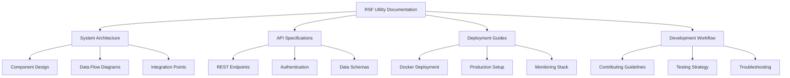

# RSF Utility Documentation Hub

**Welcome to the comprehensive documentation for RSF (Reconciliation and Settlement Framework) Utility** — an official ONDC network tool for streamlined settlement and reconciliation operations.

  

> **🚀 Quick Start**: New to RSF Utility? Start with the [main README](../README.md) for project overview and quick setup instructions.

---

## 📚 Documentation Navigation

### 🏗️ **System Architecture & Design**
| Document | Description | Audience |
|----------|-------------|----------|
| **[01-architecture.md](01-architecture.md)** | Complete system architecture, component interactions, and technology stack | Architects, Senior Developers |
| **[02-components.md](02-components.md)** | Detailed component specifications, service layer architecture | Backend Developers, System Integrators |
| **[03-workflows.md](03-workflows.md)** | Business workflows, transaction processing, and sequence diagrams | Business Analysts, Full-Stack Developers |

### 🔌 **Integration & APIs**
| Document | Description | Audience |
|----------|-------------|----------|
| **[04-apis.md](04-apis.md)** | Complete REST API documentation, endpoints, schemas, and examples | Frontend Developers, API Consumers |
| **[05-data-models.md](05-data-models.md)** | Database schemas, data relationships, and validation rules | Backend Developers, Database Administrators |

### 🚀 **Deployment & Operations**
| Document | Description | Audience |
|----------|-------------|----------|
| **[06-deployment.md](06-deployment.md)** | Production deployment, Docker configurations, and infrastructure setup | DevOps Engineers, System Administrators |
| **[07-operations-observability.md](07-operations-observability.md)** | Monitoring, logging, alerting, and operational procedures | SRE, Operations Teams |
| **[08-security.md](08-security.md)** | Security implementation, authentication, and compliance | Security Engineers, Compliance Teams |

### 🛠️ **Development & Maintenance**
| Document | Description | Audience |
|----------|-------------|----------|
| **[09-troubleshooting.md](09-troubleshooting.md)** | Common issues, debugging guides, and emergency procedures | Support Teams, All Developers |
| **[10-contributing.md](10-contributing.md)** | Development workflow, coding standards, and contribution guidelines | Contributors, New Team Members |
| **[TODO-INDEX.md](TODO-INDEX.md)** | Consolidated TODO tracking and technical debt management | Project Managers, Development Teams |
| **[CHANGELOG.md](CHANGELOG.md)** | Version history, feature additions, and breaking changes | All Stakeholders |

---

## 🎯 **Quick Navigation by Role**

### 👨‍💻 **New Developer Onboarding**
1. **Start Here**: [Main README](../README.md) - Project overview and quick setup
2. **Architecture**: [01-architecture.md](01-architecture.md) - Understand the system design
3. **Components**: [02-components.md](02-components.md) - Learn service architecture
4. **Development**: [10-contributing.md](10-contributing.md) - Setup development environment
5. **APIs**: [04-apis.md](04-apis.md) - API integration patterns

### 🏗️ **System Architect / Technical Lead**
1. **Architecture**: [01-architecture.md](01-architecture.md) - Complete system design
2. **Components**: [02-components.md](02-components.md) - Service layer specifications
3. **Data Models**: [05-data-models.md](05-data-models.md) - Database design and relationships
4. **Security**: [08-security.md](08-security.md) - Security architecture and compliance
5. **Deployment**: [06-deployment.md](06-deployment.md) - Infrastructure and deployment strategy

### 🚀 **DevOps / Platform Engineer**
1. **Deployment**: [06-deployment.md](06-deployment.md) - Infrastructure setup and deployment
2. **Observability**: [07-operations-observability.md](07-operations-observability.md) - Monitoring and logging
3. **Troubleshooting**: [09-troubleshooting.md](09-troubleshooting.md) - Operational procedures
4. **Security**: [08-security.md](08-security.md) - Security configurations
5. **Architecture**: [01-architecture.md](01-architecture.md) - Infrastructure components

### 🎨 **Frontend Developer**
1. **APIs**: [04-apis.md](04-apis.md) - REST API documentation and integration
2. **Workflows**: [03-workflows.md](03-workflows.md) - User interaction flows
3. **Components**: [02-components.md](02-components.md) - Frontend architecture patterns
4. **Contributing**: [10-contributing.md](10-contributing.md) - Development workflow
5. **Troubleshooting**: [09-troubleshooting.md](09-troubleshooting.md) - Common frontend issues

### ⚙️ **Backend Developer**
1. **Components**: [02-components.md](02-components.md) - Service layer architecture
2. **Data Models**: [05-data-models.md](05-data-models.md) - Database schemas and relationships
3. **APIs**: [04-apis.md](04-apis.md) - API implementation details
4. **Workflows**: [03-workflows.md](03-workflows.md) - Business logic implementation
5. **Security**: [08-security.md](08-security.md) - Authentication and authorization

### 📊 **Business Analyst / Product Manager**
1. **Workflows**: [03-workflows.md](03-workflows.md) - Business processes and user flows
2. **Architecture**: [01-architecture.md](01-architecture.md) - System capabilities overview
3. **APIs**: [04-apis.md](04-apis.md) - Feature specifications and data flows
4. **TODO Index**: [TODO-INDEX.md](TODO-INDEX.md) - Outstanding features and improvements
5. **Changelog**: [CHANGELOG.md](CHANGELOG.md) - Feature history and roadmap

### 🛡️ **Security / Compliance**
1. **Security**: [08-security.md](08-security.md) - Complete security implementation
2. **Architecture**: [01-architecture.md](01-architecture.md) - Security architecture overview
3. **APIs**: [04-apis.md](04-apis.md) - API security and authentication
4. **Deployment**: [06-deployment.md](06-deployment.md) - Infrastructure security
5. **Data Models**: [05-data-models.md](05-data-models.md) - Data protection and validation

---

## 🔍 **Documentation Features**

### 📖 **Content Quality Standards**
- **Production-Ready**: All documentation follows enterprise-grade standards with comprehensive examples
- **Comprehensive Coverage**: End-to-end system documentation with real-world usage scenarios
- **Regular Updates**: Documentation synchronized with code changes via automated processes
- **Cross-Referenced**: Internal linking for easy navigation between related concepts
- **Mermaid Diagrams**: Visual representations of architecture, workflows, and data flows
- **Backend-Style Structure**: Follows proven documentation patterns from backend implementation

### 🎯 **Documentation Scope**

### 🔄 **Documentation Maintenance**
- **Backend Integration**: Documentation harvested and synchronized from backend repository
- **Frontend Integration**: Frontend architecture patterns integrated with backend documentation style  
- **Unified Structure**: Single source of truth combining both submodule architectures
- **Synchronized Updates**: Backend documentation changes are automatically reflected
- **Version Control**: Documentation versioned alongside code changes
- **Review Process**: Technical reviews for accuracy and completeness
- **Feedback Loop**: Continuous improvement based on user feedback

---

## 🏷️ **Document Categories**

### 🟢 **Core System Documentation** (Must Read)
Essential documents for understanding RSF Utility system design and implementation.

- **[01-architecture.md](01-architecture.md)** - System architecture and component interactions
- **[02-components.md](02-components.md)** - Detailed service specifications
- **[04-apis.md](04-apis.md)** - Complete API documentation

### 🟡 **Implementation Guides** (Developer Focused)
Practical guides for system implementation and integration.

- **[03-workflows.md](03-workflows.md)** - Business workflow implementation
- **[05-data-models.md](05-data-models.md)** - Database design and schemas
- **[10-contributing.md](10-contributing.md)** - Development workflow

### 🟠 **Operational Documentation** (Ops Focused)
Deployment, monitoring, and operational procedures.

- **[06-deployment.md](06-deployment.md)** - Production deployment procedures
- **[07-operations-observability.md](07-operations-observability.md)** - Monitoring and observability
- **[09-troubleshooting.md](09-troubleshooting.md)** - Operational troubleshooting

### 🔴 **Security & Compliance** (Security Critical)
Security implementation and compliance documentation.

- **[08-security.md](08-security.md)** - Security architecture and implementation

### ⚪ **Project Management** (Planning & Tracking)
Project planning, tracking, and historical documentation.

- **[TODO-INDEX.md](TODO-INDEX.md)** - Technical debt and future work tracking
- **[CHANGELOG.md](CHANGELOG.md)** - Version history and change tracking

---

## 🔗 **External Resources**

### 📊 **ONDC Network Resources**
- [ONDC Network Documentation](https://ondc.org/docs)
- [ONDC Protocol Specifications](https://github.com/ONDC-Official/ONDC-RET-Specifications)
- [ONDC Developer Portal](https://developer.ondc.org)

### 🛠️ **Technology Stack Documentation**
- [Node.js Documentation](https://nodejs.org/docs)
- [React Documentation](https://react.dev)
- [MongoDB Documentation](https://docs.mongodb.com)
- [Docker Documentation](https://docs.docker.com)

### 📈 **Monitoring & Observability**
- [Prometheus Documentation](https://prometheus.io/docs)
- [Grafana Documentation](https://grafana.com/docs)
- [Loki Documentation](https://grafana.com/docs/loki)

---

## 🎯 **Getting Started Checklist**

### For New Team Members
- [ ] Read [Main README](../README.md) for project overview
- [ ] Review [01-architecture.md](01-architecture.md) for system understanding
- [ ] Follow [10-contributing.md](10-contributing.md) for development setup
- [ ] Explore [04-apis.md](04-apis.md) for API integration
- [ ] Check [TODO-INDEX.md](TODO-INDEX.md) for available work items

### For System Integrators
- [ ] Study [01-architecture.md](01-architecture.md) for integration points
- [ ] Review [04-apis.md](04-apis.md) for API specifications
- [ ] Understand [08-security.md](08-security.md) for security requirements
- [ ] Check [06-deployment.md](06-deployment.md) for deployment options
- [ ] Review [03-workflows.md](03-workflows.md) for business processes

### For Operations Teams
- [ ] Study [06-deployment.md](06-deployment.md) for deployment procedures
- [ ] Review [07-operations-observability.md](07-operations-observability.md) for monitoring
- [ ] Understand [09-troubleshooting.md](09-troubleshooting.md) for issue resolution
- [ ] Check [08-security.md](08-security.md) for security procedures
- [ ] Familiarize with [01-architecture.md](01-architecture.md) for system context

---

## 📞 **Support & Feedback**

### 📝 **Documentation Feedback**
If you find issues with this documentation or have suggestions for improvement:
1. **Create an Issue**: [GitHub Issues](https://github.com/ONDC-Official/rsf-utility/issues)
2. **Submit a PR**: Follow [Contributing Guidelines](10-contributing.md)
3. **Contact Team**: Reach out via ONDC official channels

### 🆘 **Technical Support**
For technical support and implementation assistance:
- **Documentation Issues**: Check [09-troubleshooting.md](09-troubleshooting.md)
- **API Questions**: Refer to [04-apis.md](04-apis.md)
- **Deployment Help**: Review [06-deployment.md](06-deployment.md)
- **Security Concerns**: Consult [08-security.md](08-security.md)

---

**Last Updated**: December 2024  
**Documentation Version**: 1.0.0  
**Maintained by**: ONDC RSF Utility Team

*This documentation hub is continuously updated to reflect the latest system architecture and implementation. For the most current information, always refer to the latest version in the main repository.*
